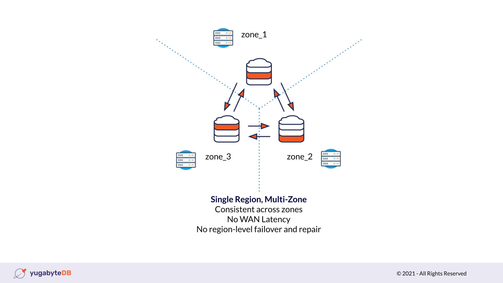
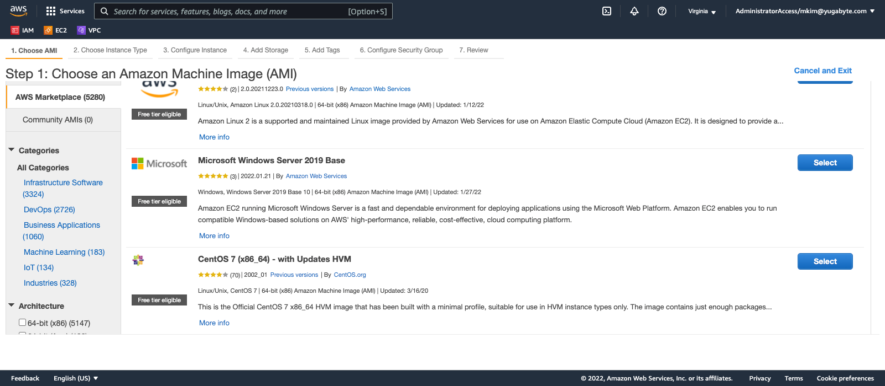
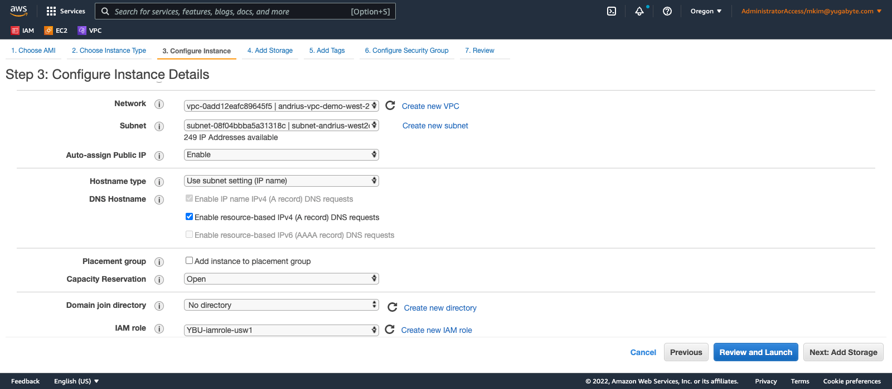
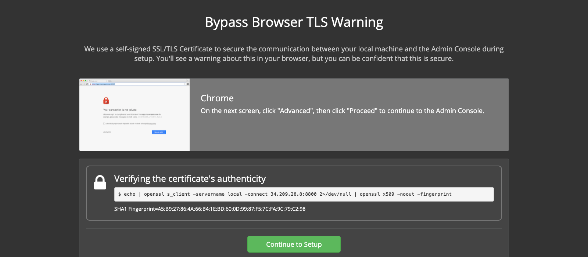
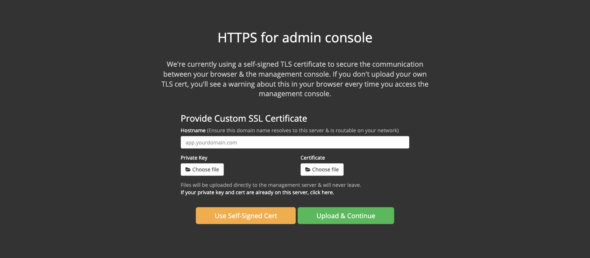
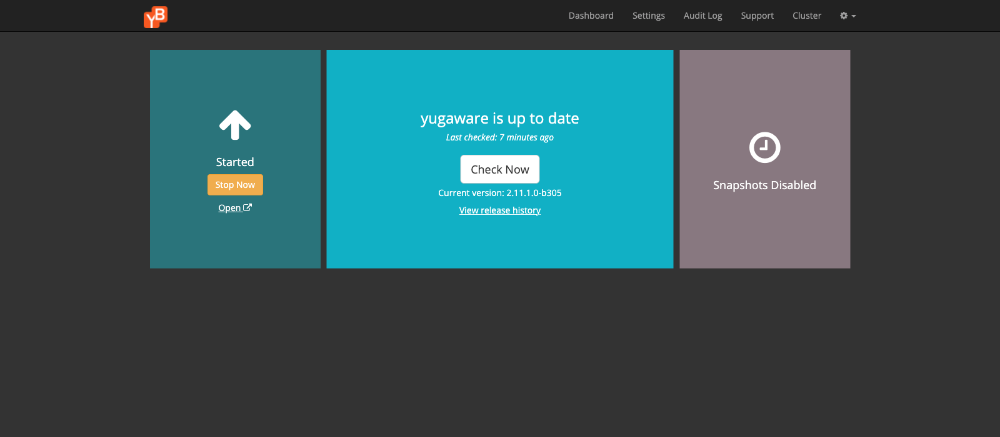
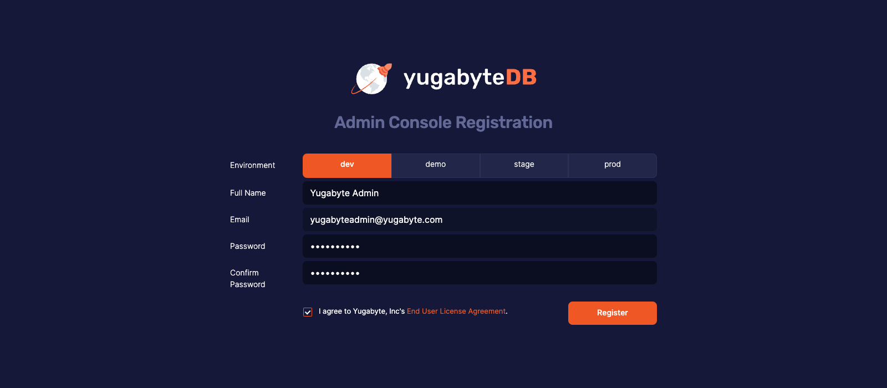
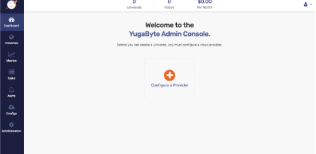
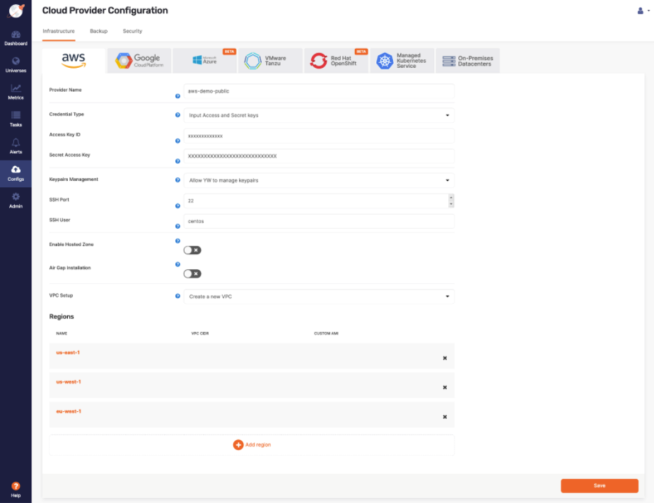
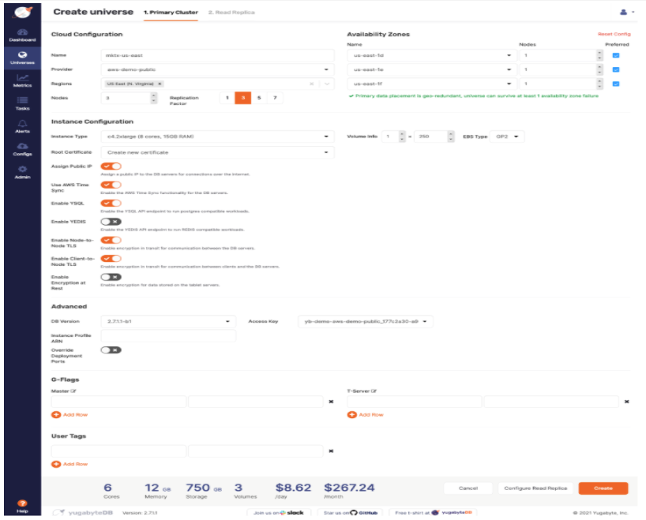

# Create a Yugabyte Multi-Zone Universe using Platform (Anywhere)

## Introduction

In this hands-on deployment lab, you will create a Yugabyte Universe that consists of a three node cluster in a multi-zone topology. Each node will reside in the same region, but in a different availability zone. The purpose is to demonstrate Yugabyte Platform's ability to provide high availability and workload distribution. The added resiliency in a multi-zone topology protects against potential failures in case resources in a single availability zone become unavailable. This topology can withstand a single zone failure, but not two or more.

The topology of this three-node database cluster includes a node in each availability zone in a single region as shown in the following diagram:



### Objective
As an engineer, I want to install Yugabyte Platform on AWS to demonstrate how to deploy a three node cluster in a multi-zone topology.
## Prerequisites

Before creating a universe, the cloud provider environment must first be configured according to the specifications found on the [Yugabyte docs page on cloud configuration.](https://docs.yugabyte.com/latest/yugabyte-platform/configure-yugabyte-platform/set-up-cloud-provider/aws/) This is to secure the database as well as create access points in the VPC to allow YugabyteDB to connect and communicate with the different nodes in the cluster.

> **Important:** Make a careful note whatever region that contains the VPC will be where the EC2 instance will be launched.

In this lab, we will focus on deployment with AWS.

Therefore the access key ID and secret id key for programmatic access for your IAM user will be necessary to obtain from your AWS account.

Obtain the Yugabyte Platform license file (.rli) from your Yugabyte representative to download the Yugabyte Platform Management Console.
## Checklist of necessary steps to install Yugabyte Platform

* Complete AWS prerequisites (IAM role, access keys, Routing Table entry, Security Group, VPC + subnets, Internet Gateway)

* Obtain the AWS IAM user's access key ID and secret access key. These must specifically be enabled for programmatic access so the Yugabyte Platform can create the nodes in your region. [For more information about the access key ID and secret access key review the AWS docs on AWS credentials.](https://docs.aws.amazon.com/general/latest/gr/aws-sec-cred-types.html)

* Obtain the Yugabyte Platform license file (.rli) from a Yugabyte Representative.

* Create an AWS EC2 instance to run the Yugabyte Platform Management Console.

* Deploy Yugabyte Platform onto the cloud provider, AWS.

* Create a YugabyteDB Universe using Yugabyte Platform.

### Launch the EC2

Once the VPC, security group, IAM role, subnets, routing table entry, and Internet Gateway have been set up as required in us-west-2, we can proceed with launching the EC2 instance using an AMI. The EC2 will perform as the server that will host the Yugabyte Platform Management Console.

To begin, log into the Amazon account and navigate to the EC2 console to launch an instance with the following specifications:

| Type      | Description |
| ----------- | ----------- |
| Instance Type      | c5.4xlarge       |
| AMI   | ami-00e87074e52e6c9f9        |
| OS   | CentOS 7.9.2009 x86_64        |
| Region   | us-west-2       |
| Disk Storage      | 32GiB, gp3       |
| VPC   | (Prerequisite-YBU-59)        |
| Security Group   | (Prerequisite-YBU-59)        |
| IAM role   | YBU-iamrole-usw1        |
| SSH access key   | Generate and save       |
| Security Key Pair  | ybu-yugaware \| RSA  - request from Yugabyte representative     |

The following image can be found in the AWS marketplace in most regions:



In this lab, we will be using a `c5.4xlarge`, in order to demo production level workloads. The specifications of this instance type allow for the necessary processing power, 16 cores with 32GiB RAM, that are necessary to demonstrate Yugabyte Platform effectively when running production workloads.

> **Important:** When creating the EC2 instance, ensure the Public IP address setting is ENABLED if it is desired to connect to the server from outside the AWS VPC (eg. from users’ workstations or applications running in Kubernetes environments).

The Configure Instance Details page will look similar to the following image:



> **Important:** Select "Delete on Termination", when selecting the additional storage for a demo otherwise the EBS volume will remain even after the EC2 instance is terminated. 

SSH into the EC2 once it is running to configure the environment for the Yugabyte Platform Management Console.

## Install Yugabyte Platform

In the last step, you launched an EC2 instance using the specification and VPC environment required by Yugabyte Platform.

In this step, you will connect to the server and set up the initial configuration so that you can install Replicated, a third party tool used to verify the Yugabyte license and install Yugabyte Platform.

### Setup the Initial Configuration

Once connected to the server by SSH in the terminal, perform the initial configuration steps to install the Yugaware platform.

* Set the hostname: `sudo hostnamectl set-hostname platform`

* Update the Operating System on the server: `sudo yum -y update`

* Install `wget`: `sudo yum install -y wget`

* Install `curl`: `sudo yum install -y curl`

### Install Replicated on the Server

Once the server has been configured and is in the "Running" state, you will use Replicated to pull the Yugabyte Platform image once the license has been authenticated.

The following Replication script will first install the correct version of Docker onto the server, then download and run the required Docker containers from the Replicated repository. 

In order to complete this step, the Platform 2.11 (latest) license file, which ends in a `.rli` extension, must be obtained from a Yugabyte representative.

Logged in as the user, `centos` (default), runs the following command on the server to install Replicated and Docker:

```bash
curl -sSL https://get.replicated.com/docker | sudo bash
```

Once the script has run, a series of prompts will appear in the terminal.

```bash
The installer will use service address '<my EC2 public IP address>' (discovered from EC2 metadata service)
The installer has automatically detected the service IP address of this machine as '<my EC2 public IP address>'.
Do you want to:
[0] default: use '<my EC2 public IP address>'
[1] enter new address
Enter desired number (0-1): 0
```

```bash
Do you need a proxy to connect to the internet?
No
```

Once these questions have been answered, Replicated and Docker will be installed on your server.

To verify the installation on your server has completed, you will receive the following output in your terminal:

```bash
Operator installation successful
To continue the installation, visit the following URL in your browser:
  http://xx.xxx.xxx.xx:8800
To create an alias for the replicated cli command run the following in your current shell or log out and log back in:
  source /etc/replicated.alias
```

The URL in your message will reflect the public IP of your server. Navigate to this IP at port 8800 to configure, authenticate, and install Yugabyte Platform on the server.

### Upload the Yugabyte Platform license to Install

In the last step, we configured the server and installed Replicated. In this step, you will pull the Yugabyte Platform image from the Replicated registry once the license has been authenticated.

Navigate to the IP address of your server at port 8800 in your browser to connect to the Replicated console as noted in the proceeding terminal message.

There you will see the following screen:



Proceed with the Yugabyte Platform installation process with the following instructions:

* Select "Continue to Setup" to begin the installation process.

* Next, you will see a warning message regarding a non private connection.

* Select "Advanced" and then select "Proceed to <my public IP(unsafe)>. 
   
> **Important:** There will not be any security risks in this process since we are used a self-signed SSL/TLS Certificate to secure the communication between your local machine and the Yugabyte Platform Console.

* Select "Use the Self-Signed Cert", on the next page titled "HTTPS for admin console" as shown in the following image:



* On the resulting dialog box, select "Continue without a hostname". Once the internal setup has completed, the next page will prompt you to upload the Yugabyte Platform license.

* Select "Choose license" to upload the `.rli` file from your machine.

* Once uploaded, select "Online" on the next page and select "Continue".

* The next page presents a list of Yugabyte Platform versions covered by the license. Select the "Latest" version, 2.11, then select "Continue with Latest version" as shown in the following page:

* On the "Secure the Admin Console" page, create a password. This password will log into the Replicated console to retrieve the license version and navigate to the Yugabyte Platform console.

* The next page progresses through a long list of pre-flight checks that verifies the EC2 instance has the specs to support Yugabyte Platform. The preflight checks turn green once verified. Select "Continue" to proceed with the Yugabyte Platform configuration.

* The next page titled "Settings" will consist the Database Config, Application config, and the Metrics config. In the Application config, make sure that the field "Hostname" contains the EC2 instance's IPV4 public IP.

* Leave the other fields defaults as-is and select "Save" at the bottom of the page.

* Select "Restart Now" on the dialog box titled "Settings Saved". This will begin the Yugabyte Platform installation process which will take a few moments to complete.

* Once the installation process begins, you will be navigated to the Replicated dashboard. Here you will see the status of the Yugabyte Platform installation. 
Once the status on the left panel has changed from "Starting" to "Started", select "Open" as shown in the following image:



> **Important:** You may receive a Bad Gateway 500 error the first time or two you select the link. Try the link again to display the Yugabyte Platform console which has been installed on port 80 on the server. Supported web browsers included Chrome, Firefox, and Safari.

## Add the Cloud Provider

In the last step, you installed Replicated, then used it to install Yugabyte Platform onto port 80 on the EC2 instance. In this step, you will register as a user with Yugabyte Platform, accept the license agreement, add the cloud provider, AWS, and specify the region where the Yugabyte Universe will be deployed. To complete this step, you will need the AWS access and secrets keys to your AWS account to allow Yugabyte Platform to create the AWS infrastructure for the three cluster node.

Once you have navigated to the Yugabyte Platform console you will see the following which displays the registration form for the Yugabyte Platform:



Keep these credentials handy to login since they will be necessary to authenticate into Yugabyte Platform.

* Select the `dev` Environment for this lab.

* Enter your credentials, check the End User License Agreement, then select "Register"

* On the next screen, enter the email and password then select "Login".

* Once your credentials have been authenticated, you will be navigated to the following screen:

<!-- > **TODO:** Add Screenshot Yugabyte Platform Admin Console -->


### Configure the Cloud Provider

> **Important:** To complete this step, you will need your access and secret keys for the EC2 instance.

One or more cloud providers can be configured. A provider is a set of configuration properties for accessing physical resources on which to build YugabyteDB Universes. 

Select the "Configure a Provider" button to add a provider on the Cloud Provider form. 
This page can also be accessed by selecting the "Configs" option on the left hand menu panel.

In this lab, we will continue using AWS as the cloud provider.

<!-- > **TODO:** Add Screenshot Cloud Provider Configuration Form  -->


> **Important:** Only use lower case characters and hyphens "-".

1. Provider Name: my AWS environment

2. Credential Type: leave as default: "Input Access and Secret Keys

3. Access Key ID: Enter the Access Key

4. Secret Access Key: Enter the Secret Key

5. Keypairs Management: leave at the default “allow YW to manage key pairs”

6. SSH Port: 22

7. SSH User: centos

8. Leave all subsequent fields default. (i.e. create VPC as default)

9. Select “Add region” button. The following dialog box will be displayed:

<!-- > **TODO:** Add screenshot of pop-up -->


10. Use the dropdown to select the AWS region that contains the server created in the previous steps.

> **Important:** For multi-region deployment, more than one region can be selected.

11. Select "Save" to connect Yugabyte Platform to the cloud provider. 
## Create a YugabyteDB Universe in Platform

In the last step, the cloud provider was configured and connected to the Yugabyte platform. In this step, you will deploy a multi-zone cluster in the selected AWS region.

> **Important:** The process of creating a Universe is essentially the same for all provider types, whether it be AWS, GCP, Azure, VMware, Red Hat, or  On-Prem.

1. Select the "Universes" option on the left menu.

2. Select "Create Universe" button on the top right of this screen.

This will display the following form:

<!-- > **TODO:** Screenshot of Universe Form -->


1. In the "Name" field, enter the name of the Universe: Only use lower case letters and dashes.

2. In the "Provider" field, select the cloud provider from a dropdown list that was created in the previous step.

3. In the “Regions” field, select the same region from the dropdown list that contains the server.

Once the region has been selected, a new section of the page will appear with the three availability zones as configured in the provider, with the default distribution of one YugabyteDB node in each AZ. Note that since the RF or Replication Factor was set at 3, we will create a 3 node cluster.

> **TODO:** Add screenshot of each AZ.

> **Important:** To increase capacity, an option is to change the number of nodes to 2 per zone, to make 6 nodes in total (leave the Replication Factor at the default of 3).

4. In the “Instance Type” field enter the EC2 instance type we created previously in this lab: c5.2xlarge. (8 cores and 16GiB RAM) 

The completed form should look similar to the following image:

<!-- > **TODO:** Screenshot of a completed form -->


5. Select the "Create" button to deploy the configured universe onto the server.

Once the process has begun, a progress bar will update the current status of the Universe being created. After several minutes, the process will complete and the status will update to "Ready". The following image verifies that the Universe has been successfully completed.

<!-- > **TODO:** Screenshot of a multi-zone three node cluster -->


## Automated Tooling

* Automated alerts for failures and warnings that affect capacity.

* Automated monitoring for Reads and Writes.

* Cost monitoring for YugabyteDB Platform.

* Health monitoring

* Backups

* Replication

* Queries

* Nodes

> **TODO:** Troubleshooting

