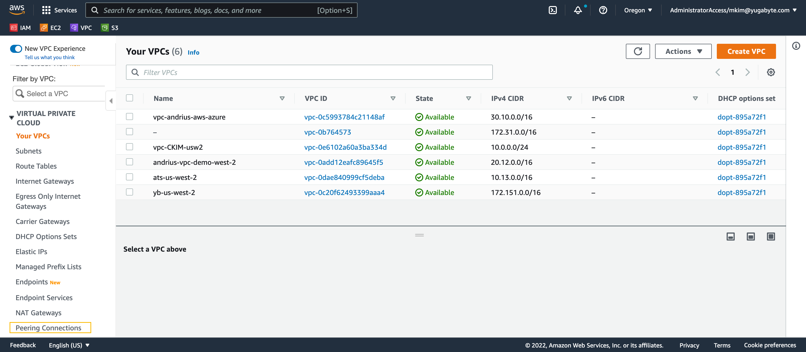

# Run a Workload on a Multi-node Universe

## Introduction

In this hands-on lab, you will use xCluster, or cross cluster, replication to connect two independent YugabyteDB universes in a multi-region topology. The reason why a client would want this type of set up is to create high availability and resiliency in different geographical regions. Therefore if a region sustained a large scale outage due to a weather event, power outage, human error, hacker attack, or other natural or political disaster, having cross cluster replication in geographically separate regions would prevent any downtime. YugabyteDB has demonstrated this many times as the most fail safe topology for mission critical performance.

Up until now, you have created a single cluster that is geographically distributed across different availability zones. You can also stretch a cluster across different geographic regions as well. These topologies are considered synchronous replication.

But many clients often can't justify the additional complexity or operational costs involved with synchronous replication in a multi-regional topology. These clients can use asynchronous replication offered by xCluster to save and simplify, although the trade off is a decrease in consistency from transactional to timeline consistency due to the asynchronous nature of the replication.

For a deeper dive into the different types of regional replication methodologies and their use cases, review the [Yugabyte docs on multi-region deployment](https://docs.yugabyte.com/latest/explore/multi-region-deployments/).

In this lab, you will connect two independent three node multi-zone clusters. You will use AWS as the cloud provider to deploy both clusters. One cluster will be in located in us-west-2 and the other will be in the us-east-1. You will begin by implementing unidirectional replication, meaning a source cluster will replicate its data from a table to a target cluster. Any writes made to the source cluster will be replicated to the target cluster. Any writes made to the target cluster however, will not be replicated to the source cluster. Hence the unidirectional data flow only goes from the source to the target, in our case the west to the east. This is known as an Active-Passive set up. 

After that, you will implement a bidirectional replication, meaning both clusters will replicate data changes to the other cluster region. This is known as an Active-Active replication.

It is important to note that with asynchronous replication, there is no longer a dependency on the Raft consensus algorithm. Instead, the YugabyteDB layer uses the change data capture (CDC) tool to ensure that changes in the data are automatically applied to remote data repositories. Similar to the Raft consensus, CDC is applied at the DocDB layer and therefore works with both YSQL and YCQL APIs. For a closer look at the [CDC technology take a look at the Yugabyte Docs.](https://docs.yugabyte.com/latest/architecture/docdb-replication/change-data-capture/)

### Objective

As a sales engineer, I want to connect two YugabyteDB clusters located in different regions to demonstrate xCluster replication to illustrate the best-in-class resiliency of YugabyteDB.

## Requirements

* A deployed YugabyteDB cluster on AWS in us-east-1 on Platform version 2.11.2.

* A deployed YugabyteDB cluster on AWS in us-west-2 on Platform version 2.11.2..

* Both `.pem` key files to connect of their respective YugabyteDB servers hosting Platform.

* Yugabyte Platform credentials for both clusters.

## Cluster setup

In the initial set up for both clusters, there are a couple things to keep in mind. 

First, it's recommended to use the same versions of Platform to avoid any configuration errors. This lab demonstrates xCluster replication with both clusters on Platform version 2.11.2. To get a detailed step by step lab on how to setup a three node multi-zone topology, review the **LAB: AWS Cloud Infrastructure** and **LAB: Create a Multi-Zone Universe using Yugabyte Platform**. To upgrade your Platform version, take a look at **LAB: Platform Version Update**. You will want to change the license to Latest in 2.11.1, and check for updates to get to 2.11.2. As new stable versions are released, please note the cadence of change for each release is about once a quarter.

Second, you must change the length of time the YB-Master will declare a node unhealthy since this topology requires remote network communications. This is done with a configuration property, also known as a G-Flag, called **--leader_failure_max_missed_heartbeat_periods**. You will extend this time from the default value of 6 seconds to 10 seconds. You can do this in the Platform UI by following the step by step directions in **LAB: Rolling Config Changes**. this configuration can also be declared when first setting up the universe as well.

## Create a Peering Connection

To connect two regions together in AWS, a peering connection is needed to link the regional VPCs together. This route will allow one cluster to replicate data to another cluster in different virtual private clouds.

A virtual private cloud or VPC is an isolated virtual network located in a region. VPCs do not extend beyond a single region. For more information about [how VPCs work, visit the AWS docs.](https://docs.aws.amazon.com/vpc/latest/userguide/what-is-amazon-vpc.html) 

### Create the peering connection request

To create a peering connection you must assign requester and accepter roles to each VPC. In this lab, you will assign the VPC in the west to become the requester and the VPC in the east region to be the accepter. This designation is arbitrary and could've been reversed, but is important to avoid confusion, especially if more VPCs need to be connected. For a closer look at [VPC peering visit the AWS docs.](https://docs.aws.amazon.com/vpc/latest/peering/what-is-vpc-peering.html)

Create the peering connection request by following these steps:

* Navigate to the AWS VPC console in the us-west-2 region in the browser. 

* Make a note of the VPC id for the requester VPC in the us-west-2 region. You will need this later to create the peer connection. 

* Make a note of the CIDR block for the requester VPC also. This will be added to the routing table in the accepter VPC later in this lesson.

* Select the **Peering Connections** option located on the left menu in the Virtual Private Cloud section as shown in the following image:



* Select the **Create peering connection** button on the top right side of the page.

* Name the peering connection using the standard naming convention, pc-<4-letter-username>-usw2-use1, to state the regions that will be connected, for example, **pc-CKIM-usw2-use1**.

* Select the local VPC in that region that will be connected, in this example, vpc-CKIM-usw2.

* Once the VPC is selected, note that the CIDR block is automatically populated.

> **Important:** In order for the peering connections to work, the CIDR blocks cannot overlap. This would cause a conflict and make the peering connection fail. For more information regarding CIDR blocks, refer to the [Wikipedia page on Classless Inter-Domain Routing or CIDR.](https://en.wikipedia.org/wiki/Classless_Inter-Domain_Routing)

* Select the region that contains the VPC you wish to connect to, in this case **us-east-1**.

* Enter the VPC ID of the accepter VPC, located in the **us-east-1** region.

* Add the Name tag, pc-CKIM-usw2-use1, to identify the regions being connected.

* Select **Create peering connection** to provision this network connection.

* If successful, a message states that the peering connection request has been created, however to make this connection active, this request must be accepted.

### Accept the peering connection request

* Navigate to the us-east-1 VPC console in the browser.

* Make a note of the VPC id for the accepter VPC in the us-east-1 region. You will need this later to validate the peer connection.

* Make a note of the CIDR block for the accepter VPC. This will be added to the routing table in the requester VPC later in this lesson.

* Select the **Peering Connections** option in the menu on the left side of the page.

* Select the radio button of the peering connection that is in the state **Pending acceptance**. The peering connection can further be validated by comparing the VPC IDs of the two VPCs being connected.
  
* Select the Action drop down at the top right of the page.

* Select **Accept request**.

* Verify the VPC IDs are correct and select **Accept request**.

Now that the peering connection has been created, one last step is needed to ensure this network connection has been made. You need to add the CIDR block to the routing table of each VPC. This ensures that requests will be routed to the correct subnet and address.

### Add the peering connection routes

Now that the peering connection has been established, you must add the final step to route the requests to the correct address. You will do this by adding a route to the routing table in the respective VPC. By adding the CIDR block to each VPC, you can enable bidirectional communication between the two regions through their VPCs.

* In the us-east-1 VPC console, select **Your VPCs** to view all the VPCs in this region.

* Select the accepter VPC, in this case vpc-SLUE-use1. This will navigate you to the details page of the accepter VPC. 

* Select the **Main route table** to navigate to the Route tables page.

* Scroll down to and select the **Routes** tab.

* Select **Edit routes**.

* Select **Add route**.

* In the Destination field, add the CIDR block for the requester VPC in the west region.

* In the Target field select **Peering Connection** and add the connection you created, for example, **pc-MKIM-usw2-use1**.

* Select **Save changes**.

Now the route has been added, requests from the VPC in the east will successfully reach the CIDR block located in the VPC in the west region.
To make network requests from the VPC in the west successfully reach the CIDR block in the east, you must add the CIDR block of the east region into the route table of the VPC in the west region.

To add this route, follow these steps:

* Go the the us-west-2 region and select the VPC in the peering connection.
  
* Navigate to the routing table using the preceding steps and add the route with the CIDR block for the accepter VPC in the east region.

* **Save changes**.

### Verify the peer connection is working

Now the network route between the VPCs has been established, you need to verify that the connection work.

One way to test this connection is to SSH into the EC2 instance hosting Platform in the west region. Then try to SSH from that EC2 instance into the EC2 instance in the east region.

You will need to carefully copy the respective **.pem** key file with a notepad or text editor, not an IDE due to the character modifications in different editors. Remember to delete this key once this test has completed for security concerns since this was only for testing purposes.

## Create xCluster replication

Now that the network provisioning work has been completed, you will create an xCluster with unidirectional replication with Yugabyte Platform.

In this section you'll follow these steps to create a unidirectional replication between the clusters:

* Create the identical table in both clusters
 
* Retrieve the universe IDs of bother clusters

* Identify the YB-Master leader.

* Retrieve the master addresses

* Retrieve the table ID

* Configure the universe with the replication command

### Create the table to replicate

> **Important:** First you must create a table on both clusters that are identical. With xCluster replication, you must designate which table(s) will be replicated. xCluster allows you to be selective about which tables are mission critical and need HA.

In both clusters, create a `keyvalue` table using the following steps:

* SSH into the EC2 instance that hosts Yugabyte Platform. The prompt will change to **[centos@platform ~]$** if the EC2 was launched with centos. 

* Navigate to the Platform UI, select the universe that will be a part of the xCluster replication, then select the **Nodes** tab. 

* Select the **Actions** drop down of the YB-Master Leader, as labelled in the Processes column.

* Select **Connect**.

* Copy the SSH script, keep a note of this command since a lot of the validation will be done on this node.

* SSH into the node that contains the YB-Master leader. 

If successful, the prompt will change again to display the IP address and the user as shown in the following example:

```bash
[yugabyte@ip-<my-node-IP-address> ~]$
```

* Next enter the following script command to access the YSQL shell:

```bash
/home/yugabyte/tserver/bin/ysqlsh -h <my-node-IP-address> -p 5433 -U yugabyte
```

Use the IP address of the node in the preceding script command.

* Connect to the `postgres` database with the following command:

```bash
yugabyte=# \c postgres
```

* Create the **keyvalue** table with the following command:
  
```bash
CREATE TABLE keyvalue (k int, v int, PRIMARY KEY (k));
```

* Populate the table with data with the following command:

```bash
INSERT INTO keyvalue VALUES (1, 2);
```

* Verify the table and data are in the table with the following command:

```bash
SELECT * FROM keyvalue;
```

If the table and data were populated successfully, you will get the following response in the terminal:

```bash
k | v
---+---
 1 | 2
```

Now repeat this process with the other cluster and create and populate the identical table with the same data.

### Get the cluster identifier and master addresses in the source and target cluster

Now that the table has been created, you will need to retrieve the cluster ID and node's master addresses in order to configure the xCluster replication.

* Navigate to the **source** cluster's YB-Master Leader node terminal. If you are still in the YSQL shell simply run the **exit** command. This will close the YSQL shell and return your connection to the YB-Master Leader node terminal. For an example, here is what the node's terminal prompt looks like:

```bash
[yugabyte@ip-172-152-110-225 ~]$
```

* In the terminal for the node, enter the following command to view the configuration for the cluster as shown in the following script command:
  
```bash
[yugabyte@ip-172-152-110-225 ~]$ cat /home/yugabyte/tserver/conf/server.conf
```

This command returns the data needed to assign xCluster replication. The key properties you must write down are the **tserver_master_addrs** and the **cluster_uuid** for the SOURCE cluster.

```bash
--placement_cloud=aws
...
--tserver_master_addrs=172.151.37.55:7100,172.151.62.129:7100,172.151.78.12:7100
...
--cluster_uuid=e069287c-534b-41e8-83c8-c0659c0bacea
...
--leader_failure_max_missed_heartbeat_periods=10
```

> **Pro Tip:** These configuration properties, also known as G-Flags, enable fine tuning of the YugabyteDB cluster which makes the YugabyteDB run more efficiently and productively to a clients' apps specific needs.

Take special note that the following properties and their values in the preceding response:

* tserver_master_addrs

* cluster_uuid

* leader_failure_max_missed_heartbeat_periods

The **tserver_master_addrs** are the needed to use the `yb-admin` tool to enable xCluster replication. This property is referred to as the **master_addresses** in Yugabyte Docs. Note that these master addresses are assigned to port 7100. There is a master address for every replication factor. So an RF of three will reflect three master addresses. This doesn't correlate 1:1 to the number of nodes however.

The **cluster_uuid** is the unique identifier for the universe. This will be used to identify the source and target universes. Here is an example of a **cluster_uuid**: e069287c-534b-41e8-83c8-c0659c0bacea.

Note that the G-flag property, **leader_failure_max_missed_heartbeat_periods**, has the value of 10. You assigned this value at the beginning of the lesson in order to lengthen the time a master will declare a node unreachable. The larger latency is attributed to a geographically distant communication due to the multi-region topology.

### Get the table id 

In order to correctly configure cross cluster replication, you need to not only identify the cluster ids, but also the table ids. Note that you will connect one table in this lab, but multiple tables can also be configured for replication.

To retrieve the table id, you will use the **yb-admin** utility. 

The **yb-admin** utility is a powerful command line interface that is used to manage a cluster. You can not only retrieve granular data about the cluster, but also perform tasks like backup and restore, cluster property configuration, and much more. You can also find if there are any current producers or replications set up on the cluster with the command, **get_universe_config**. For more details refer to the [Yugabyte docs to find a detailed list of commands for the yb-admin utility.](https://docs.yugabyte.com/latest/admin/yb-admin/)

> **Important:** In order the use the yb-admin utility, the master addresses of the nodes must be added for every command. Currently there is an [open GitHub issue #8844](https://github.com/yugabyte/yugabyte-db/issues/8844) to disassociate this dependency.

To retrieve the table id of the source cluster using the **yb-admin** utility, enter the following script in the terminal of the node containing the YB-Master leader:

```bash
/home/yugabyte/master/bin/yb-admin \
    -master_addresses \ <my master addresses in source cluster> \
    list_tables include_table_id | grep postgres.keyvalue
```

Insert the master addresses in your source cluster in the statement above. Note that the list tables search will look for the table **postgres.keyvalue**.

A successful response will look similar to the following:

```bash
postgres.keyvalue 000033df000030008000000000004005
```

Make a note of the source table id. Although they may seem to refer to the same table, the target table id and the source table id are not the same. Now that you have retrieved the values for the source cluster id, source table id, and source master addresses, the next step is to retrieve and note these values for the target cluster. Repeat the preceding steps for the **target** cluster in the east region to execute the command for the cross cluster replication.

### Configure unidirectional replication

In order to create a replication of the table, **keyvalue**, in a cross cluster asynchronous replication, you will need to configure the target cluster to replicate from the source cluster. You will use **yb-admin** utility to administer this replication pattern.

Connect to the YB-Master's leader node in the **target** cluster and enter the following command with the information retrieved from the previous step:

```bash
/home/yugabyte/master/bin/yb-admin \
-master_addresses \
<my-target-master-addresses> \
setup_universe_replication <my-source-universe_uuid> \
<my-source_master_addresses> \
<my-source-table-ids>
```

For more information regarding these attributes visit the [Yugabyte Docs regarding setup for universe replication.](https://docs.yugabyte.com/latest/admin/yb-admin/#setup-universe-replication)

> **Pro tip:** The IP addresses for the master addresses and the tserver addresses use the IP address of the nodes. The distinction between the master addresses and tserver addresses are the port numbers, 7100 for masters and 9100 for the tservers respectively.

### Validate xCluster replication

To test that the xCluster replication has been set up successfully, insert data into the **keyvalue** table in the source cluster in the west region.

* Access the YSQL shell in the leader node and enter the following command:

```sql
INSERT INTO keyvalue VALUES (3, 6);
```

* Verify the data has populated the table in the source cluster.

```sql
SELECT * FROM keyvalue;
```

* In another terminal window, access the TARGET cluster and open the YSQL shell and enter the following command:

```sql
SELECT * FROM keyvalue;
```

The response from the table will verify that the last entry has been added to the **keyvalue** table and xCluster replication is active.

### Bidirectional replication

Currently if you try to create an entry in the target cluster, the data will not replicate into the source cluster. In order to create bidirectional replication, navigate into the source cluster's leader node terminal and repeat the preceding steps with the target universe. Use the following command as a guide to enter the universe identifier data:

```bash
/home/yugabyte/master/bin/yb-admin \
-master_addresses \
<source-master-addresses> \
setup_universe_replication <target-universe_uuid> <target_master_addresses> <target-table-ids>
```

Validate that bidirectional replication is working by logging into the YSQL shell in the leader node terminal of the target cluster and enter another row into the **keyvalue** table. Check the source cluster to see if this row was added to the table.

## Reflection

Nice work, you have set up a unidirectional and then a bidirectional replication using xCluster. This is a powerful topology to create HA and resiliency in the data layer. You have also learned the power of the **yb-admin** utility to retrieve data and manipulate the universe. **yb-admin** can be used to change topologies, create backups, restore backups, and much more. 
