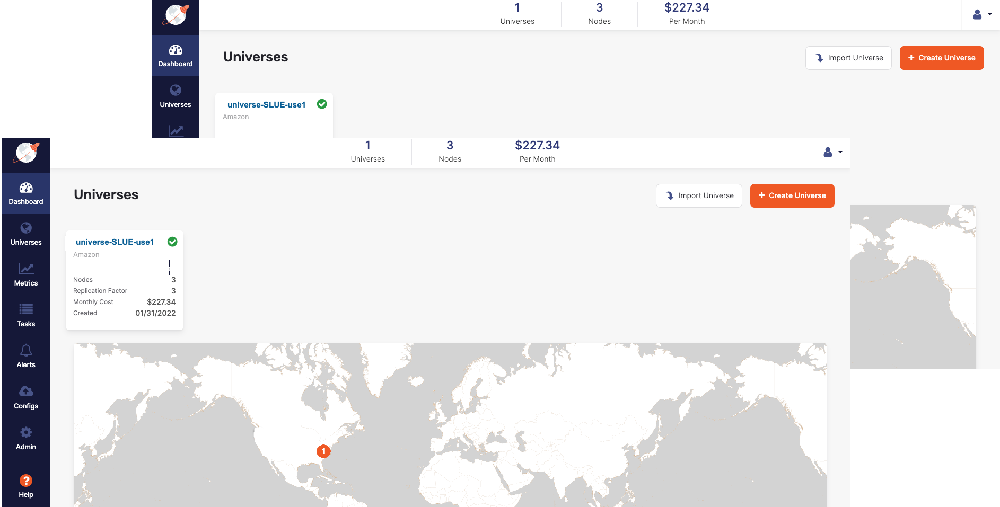
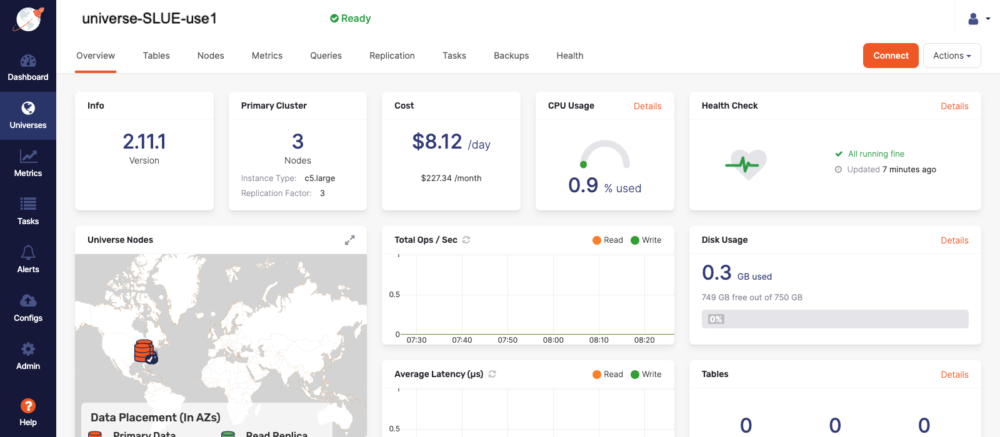
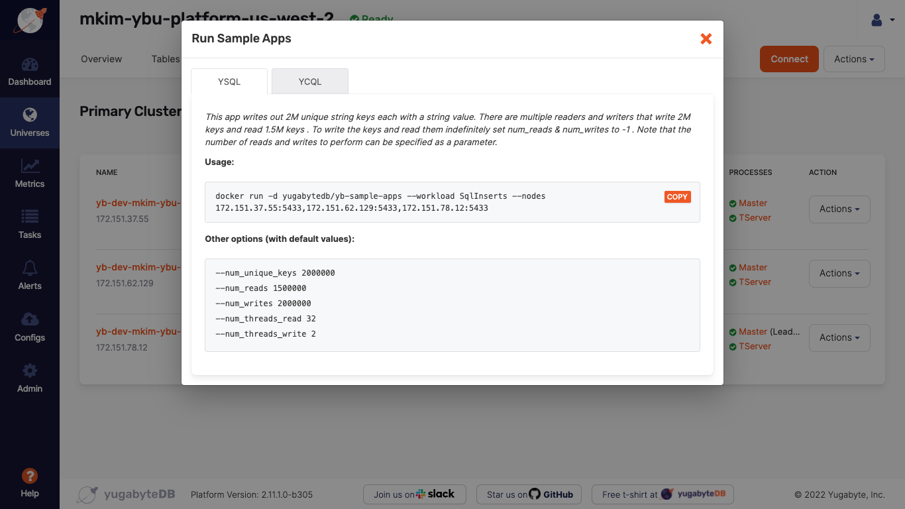
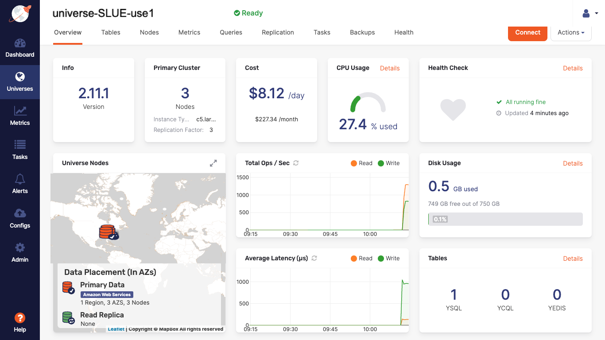

# Run a Workload on a Multi-node Universe

## Introduction

In this hands-on lab, you will run a PostgreSQL workload on a multi-node Yugabyte Universe. In this example, you will use a three node cluster in a multi-zone topology that was set up in a previous lab. Each node will reside in the same region, but in a different availability zone. The purpose is to validate the Yugabyte Universe is functioning properly as well as examine the metric tools on the Yugabyte Platform.

## Prerequisites

* Verify the Universe is running.

* Yugabyte Platform credentials.

* The `.pem` key file to connect the Platform server.

## Verify the Universe is Operational

Verify that the Universe is running by navigating to the Yugabyte Platform Console and selecting the Universe that will be running the sample workload. You can get to the Yugabyte Platform Console from the browser by navigating to the public IP of the [EC2 instance](https://us-west-2.console.aws.amazon.com/ec2/v2/home?region=us-west-2#Instances:instanceState=running) that hosts Platform management component.

Sign into Yugabyte Platform with your credentials to be taken to the Universes dashboard page as shown in the following image:



Select the Universe that will be running the workload. This will take you to the Universe details page as shown in the following image:



There will be a green "Ready" displayed next to the Universe name at the top of the page if it is operational. Also verify that the Primary Cluster has 3 nodes whose status is "Live" by selecting the "Nodes" tab.

### Retrieve the Workload Script

In the upper right corner of the page underneath the profile icon on the Universes details page is the "Actions" button. Selecting this will open a drop down menu. 

Select the "Run Sample Apps" option.

This opens the following dialog box:



* Select the YSQL option(default view).

* Copy and make a note of this script to execute later in the CLI, once you SSH into the EC2 instance that contains Yugabyte Platform.

> **Important:** In order for the script to run, `sudo` must be prefixed to the proceeding command.

## Run a YSQL Workload

In the last step, you verified that the Universe is up and running and retrieved the YSQL script that will run the workload. In this step, you will connect to the EC2 instance to run a sample workload on the nodes of the deployed Universe.

### Connect to the Platform Server

SSH into the EC2 instance that hosts Yugabyte Platform using the EC2's public IPv4.  For details on this [review the AWS documentation](https://us-west-2.console.aws.amazon.com/ec2/v2/home?region=us-west-2#ConnectToInstance:instanceId=i-0fd7ae16524e527a1). 

> **Important:** In order to connect to the Platform server, you will need the `.pem` key that was downloaded when the EC2 instance was launched. 

Once connected to the EC2 instance in the CLI, execute the following YSQL script saved from the last step:

```bash
sudo docker run -d yugabytedb/yb-sample-apps --workload SqlInserts --nodes <my-node-ip>:5433,<my-node-ip>:5433,<my-node-ip>:5433
```

> **Important:** In order to run the proceeding workload script on a Universe that has a password authenticated YSQL database or TLS encryption in transit, it is necessary to add the user, password, and path of the locally stored `.crt` and `.key` files. By default the user is `yugabyte`. For more details for [TLS encryption in transit, review the Yugabyte official docs.](https://docs.yugabyte.com/latest/yugabyte-platform/security/enable-encryption-in-transit/) 

The prompt in the CLI will change to reflect the user `centos`, if the connection was established.

The docker container will run in the background on each of the three nodes, evidenced by their unique IP addresses on port 5433 in the `--nodes` flag.

This will run the workload `SqlInserts`. This is a sample key-value app built on PostgreSQL with concurrent readers and writers. The app inserts unique string keys into the table `postgresqlkeyvalue`.

There are a total of 21 sample workloads that can be run from the `yugabytedb/yb-sample-apps` docker image. For a full description, visit the [GitHub repo for yb-sample-apps](https://github.com/yugabyte/yb-sample-apps). Note that in addition to PostgreSQL; Cassandra and Redis workloads are also available.

### Verify Workload is Running in the Universe

In the last step, you ran a YSQL workload on our Yugabyte Universe. In this step, you will verify the workload is running and review the metrics tools. 

Navigate back to the Yugabyte Platform Console and select the Universe that contains the workload. On the Universe details page in the "Overview" tab, you can see following activity:



On the "Overview" tab, the "Total Ops/Sec" displays the reads and writes being performed by the workload. In the "Tables" window, we can see a YSQL table has been inserted into the database.

Select the "Tables" tab to see that a table, `postgresqlkeyvalue`. Review the "Health" and "Metrics" tabs to measure the performance of Yugabyte.

## Reflection

The purpose of this lab was to demonstrate how to execute a YSQL workload on the three node multi-zone Universe.

Multiple workloads can now be added to the Universe to benchmark performance. High availability and resiliency can also be demonstrated by removing a node. 

If you wish to open the YSQL shell to review logs realtime on the nodes, take a look at the Yugabyte documents.