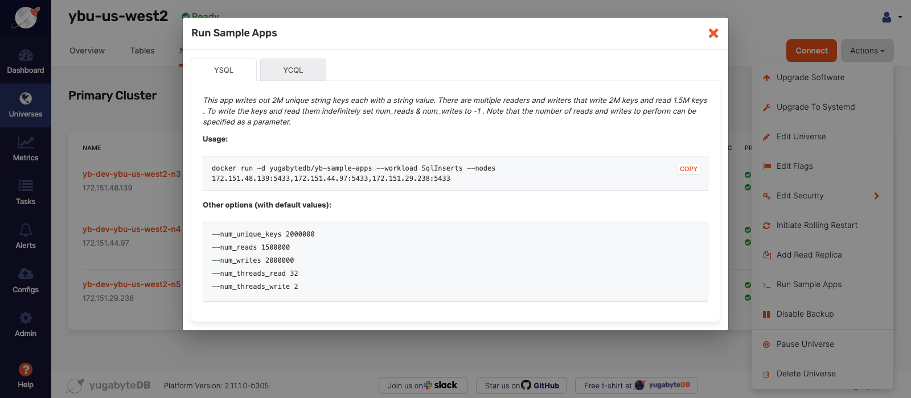

# Run a Workload on a Multi-node Universe

## Introduction

In this hands-on lab, you will run a PostgreSQL workload on a multi-node Yugabyte Universe. In this example, you will use a three node cluster in a multi-zone topology that was set up previously. Each node will reside in the same region, but in a different availability zone. The purpose is to validate the Yugabyte Universe is functioning properly as well as examine the metric tools on the Yugabyte Platform.

## Prerequisites

* Verify the Universe is running

* The `.pem` key file to connect the Platform server.

## Verify the Universe is Operational

Verify that the Universe is running by navigating to the Yugabyte Admin Console and selecting the Universe that will be running the sample workload. You can get to the Yugabyte Admin Console from the browser by navigating to the public IP of the [EC2 instance](https://us-west-2.console.aws.amazon.com/ec2/v2/home?region=us-west-2#Instances:instanceState=running) that hosts Platform management component.

Select the Universe that will be running the workload. There will be a green "Ready" displayed next to the Universe name at the top of the page if it is operational. Also verify that the Primary Cluster has 3 nodes whose status is "Live".

## Run a YSQL Workload

In the last step, we verified that the Universe is up and running. In this step, we will run a sample workload on the Universe.

### Connect to the Platform Server

We will need to SSH into the server that contains the Platform management component. Once connected in the terminal, we will be executing docker commands to run a docker image that was downloaded with the Platform management component.

> **Important:** In order to connect to the Platform server, you will need the `.pem` key that was downloaded when the EC2 instance was launched. 

The prompt in the terminal will change to reflect the user `centos` if the connection was established.

### Run the Sample Application

Once the server connection has been established, return to the Yugabyte Admin Console in the browser to retrieve the docker command to run the workload.

* Navigate to the Universe that will run the workload.

* Select the Overview tab(the default view). 

* Select the "Actions" drop down menu located in the right top corner of the screen.

* Select "Run Sample Apps" located on the bottom half of the drop down menu.

* This opens the following dialog box:

* Select the YSQL option(default view).

* Copy this command and execute it in the terminal connected to the Platform server.

The proceeding command runs the docker image, `yugabytedb/yb-sample-apps`, that was previously downloaded with the Yugabyte Platform management component.

The docker container will run in the background on each of the three nodes, evidenced by their unique IP addresses on port 5433 in the `--nodes` flag.

This will run the workload `SqlInserts`. This is a sample key-value app built on PostgreSQL with concurrent readers and writers. The app inserts unique string keys into the table `postgresqlkeyvalue`.

There are a total of 21 sample workloads that can be run from the `yugabytedb/yb-sample-apps` docker image. For a full description, visit the [GitHub repo for yb-sample-apps](https://github.com/yugabyte/yb-sample-apps). Note that in addition to PostgreSQL; Cassandra and Redis workloads are also available.

> **Important:** The proceeding docker command does not contain the flags necessary to authenticate into a password protected database and the TLS certification for in transit or at rest encryption. For these instructions for TLS certificates, review the official [Yugabyte docs on Self-Signed TLS Certificates](https://docs.yugabyte.com/latest/yugabyte-platform/security/enable-encryption-in-transit/#:~:text=Yugabyte%20Platform%20allows%20you%20to,APIs%20for%20YSQL%20and%20YCQL.) [For database authentication, review the official Yugabyte docs on enabling user authentication.](https://docs.yugabyte.com/latest/secure/enable-authentication/)

### Verify Workload is Running in the Universe

In the last step we ran a YSQL workload on our Yugabyte Universe. In this step, we will verify if the workload is running as review the metrics tool. 

Navigate back to the Yugabyte Admin Console and select the Universe that contains the workload. On the "Overview" screen, if you scroll down the page, you can see that there is activity in the Read/Write window. 

Select the "Tables" tab to see that a table has been created in the Universe, `postgresqlkeyvalue`. Review the Health and Metrics tabs to measure the performance of Yugabyte.

## Reflection

The purpose of this lab was to demonstrate how to perform a YSQL workload on the database in a Yugabyte Universe.

Multiple workloads can now to added to the Universe to benchmark performance as well as demonstrate resiliency in case of resource failures and how to remove/add nodes for high availability.