# Storage Backup and Restore on Yugabyte Platform

## Introduction

In this hands-on lab, you will learn how to create a backup of a database, then restore the database using Yugabyte Platform. The ability to backup and restore data in a straight forward and simple process is important illustrate Yugabyte's ability to weather failures, migrations, or other outage situations. In this lab, you will backup and restore a YSQL database, but understand the process for a YCQL database is nearly identical.

### Objective

As a sales engineer, I will demonstrate how to create a backup of the database and restore it. 

## Prerequisites

* A deployed Yugabyte Universe on AWS containing a populated YSQL table. For information on how to deploy a Yugabyte Universe on Platform, review the previous labs on Universe deployment for a multi-zone cluster.

* The workload `SqlInserts` has created a table named `postgresqlkeyvalue` in the Universe. This workload was downloaded along with Platform as a docker container image, `yugabytedb/yb-sample-apps`. Details on how to run a workload on a Yugabyte Universe can be found in a previous lab.

* AWS credentials to access the S3 bucket, namely the access key ID and the secret access key for the IAM user account.

* Yugabyte Platform credentials for the Yugabyte Platform console that is installed on the EC2 instance.

* The `.pem` key in order to access the EC2 instance that contains the Yugabyte Platform console.

> **Note:** In this lab, the Universe has been deployed on a `c5.4xlarge` EC2 instance using a CentOS 7 image.

## Steps to Create and Restore a Database

* Create an S3 bucket that will store the database backup.

* Configure the backup and restore location for the Yugabyte Universe as an S3 bucket.

* Backup the database to the S3 bucket.

* Drop the table and verify the Yugabyte Universe no longer contains the table.

* Restore the database.

* Verify that the table has been restored in the Yugabyte Universe without any data loss.

## Create the S3 bucket

In this step, you will create an S3 bucket with the proper permissions so the Yugabyte Universe can backup and restore the database.

Navigate to the S3 console in AWS and select the region that contains the Yugabyte Universe. In this lab, it will be `us-west-2`.

Name the bucket using the first four letters of your email address. For example, `mkim-ybu-storage-backup-us-west-2`.

> **Important:** Bucket names must be unique in a given region.

Next, use the default settings listed below and select the "Create Bucket" button.

| Property Name | Value |
|----|-----|
| AWS Region | us-west-2 (Oregon) |
| ACLs | Disabled |
| Block all public access | Enabled |
| Bucket Versioning | Disable |
| Default encryption | Disable |
| Object Lock| Disable |

### Bucket Permissions

Once the bucket has been created, you will be navigated to the Buckets list. 

Select the bucket that was just created and view the "Permissions" tab.

Review the following image to confirm that the user is able to write and read the objects that will be created in this bucket:

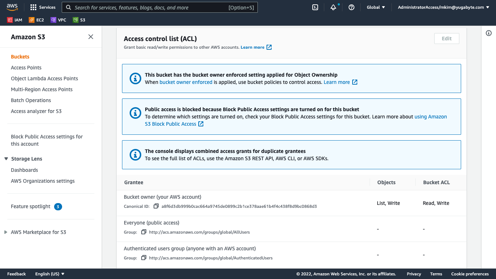

Note that in the preceding image, you have designated the bucket owner has list and write access to the objects in this S3 bucket. This permission is setup by default. This will allow the Yugabyte Universe to store and upload the database from the S3 bucket.

Keep a copy of the bucket name handy since you will need this when configuring the backup location for the Yugabyte Universe.

## Create a Database Backup

In the last step, you created an S3 bucket that will store the database backup. In this step, you will create a database backup and store it in the S3 bucket you just created.

### Verify that the Universe Contains a Table

Navigate to the Yugabyte Platform console on the EC2 instance public IPv4 on port 8800 in the browser. Once you have signed in using your credentials, you will be navigated to the Universe Dashboard page.

Select the Universe that is running the workload, `SqlInserts`. For information on how to run a sample workload on a Universe, review previous labs for details.

Once a Universe is selected, you will be navigated to the Universe details page that will present the "Overview" tab by default as shown in the following image:

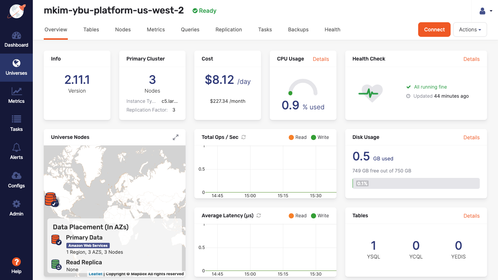

Notice in the preceding image, there is a three node cluster that's running a single YSQL table in the Universe.

Selecting the "Tables" tab, we can verify that the `postgresqlkeyvalue` table is located in the Yugabyte Universe as shown in the following image:

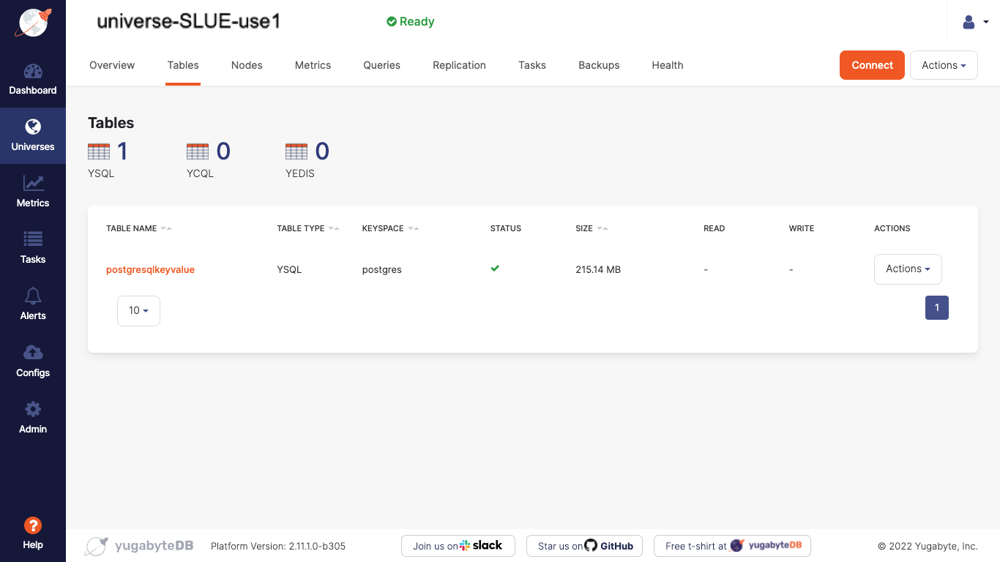

Note in the preceding image, the table type is YSQL and the keyspace is `postgres`. Keyspace is another term used for database, where the table is located.

Now that we have verified that the table is currently available in the Yugabyte Universe, you will designate the backup location and create a backup in the S3 bucket you created earlier.

### Backup the Database

In the last step, you verified that a YSQL table was available in the Yugabyte Universe. In this step, you will designate the backup location then store the backup of the database in an S3 bucket.

### Configure the Backup Location

On the left hand menu of the Yugabyte Platform console, select the "Configs" option which will display the following page:

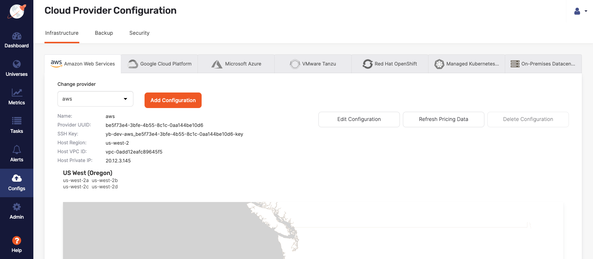

On the "Configs" page, select the "Backup" tab. Keep the default option for Amazon S3 as shown in the following image:

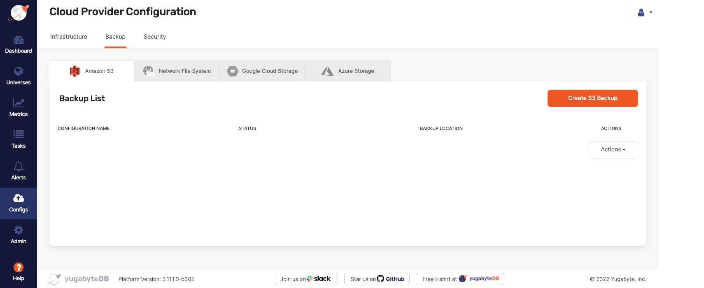

On the preceding page, select the "Create S3 Backup" button. This will display the following form:


Fill out the preceding form with the following values:

| Property Name | Property Value |
|---|----|
| Configuration Name | ybu-storage-backup-us-west-2 |
| IAM Role | Disabled |
| Access Key | \<my-access-key> |
| Access Secret | \<my-access-secret> |
| S3 Bucket | s3://\<email>-ybu-storage-backup-us-west-2 |
| S3 Bucket Host Base | s3:amazonaws.com |

Select "Save" to set the S3 bucket as the backup location.

Now that the S3 bucket has been configured in the Universe as the backup location, the next step will be to designate the database to backup.

### Assign the Database for Backup

Navigate to the Universes Dashboard page and select the Universe that contains the YSQL table you wish to backup.

Select the "Backups" tab on the Universe details page to display the following image:

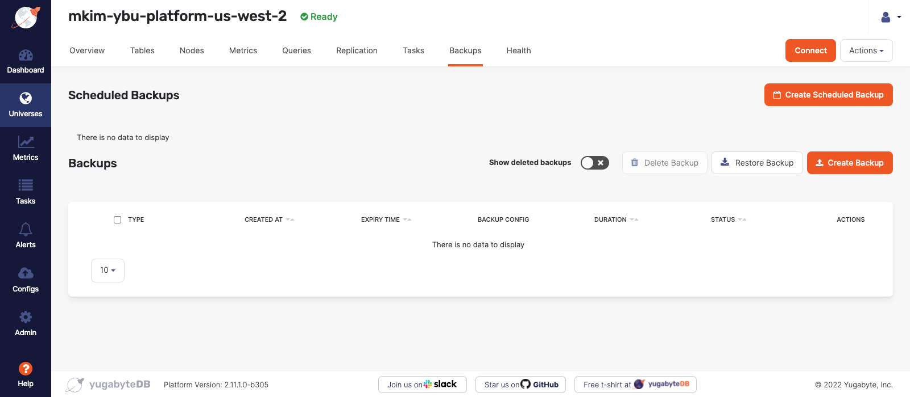

Select the "Create Backup" button on the preceding page to navigate to a form as shown in the following image:

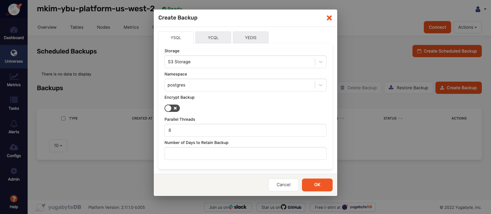

In the preceding form, enter the following property values:

| Property Name | Property Value | Default |
|----|----|----|
| Language | YSQL | Yes |
| Storage | S3 Storage | Yes |
| Namespace | postgres | No |
| Encrypt Backup | Disabled | Yes |
| Parallel Threads | 8 | Yes |
| Number of Days to Retain Backup | n/a | Yes |

Keep all the default values except the Namespace. This designates the name of the database that will be backed up, in this case, `postgres`, as we noted in the previous step. There is also an option to backup multiple databases if needed. 

> **Important:** Several backups can be created that target particular databases. Backups can also be set on an automated schedule.

In a few moments, the backup of the database will complete. Refresh the page to update the status of the backup. Once the status is "Completed", you will proceed to the next steps; to drop the table and restore it from the backup.

To verify the backup was stored in the S3 bucket, go to the S3 console in AWS as shown in the following image:

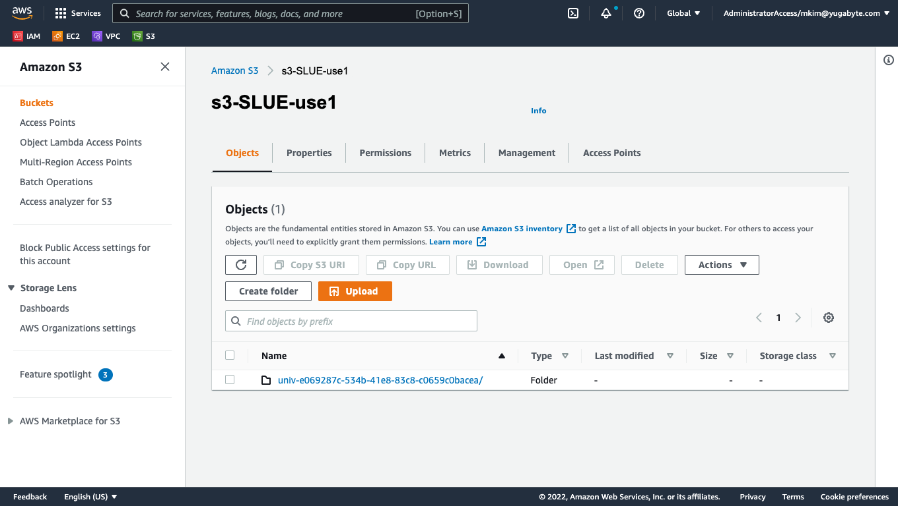

Now that the backup has been verified, the next step is to drop the table. To do this, you will need to connect to the database with the YSQL shell. Since the table is distributed on the nodes of the Universe, you will need to connect to a node in the cluster first.

To get the SSH command to connect to a node, navigate to the "Nodes" tab on the Universes details page and select the "Actions" drop down located in the Primary Cluster window as shown in the following image:

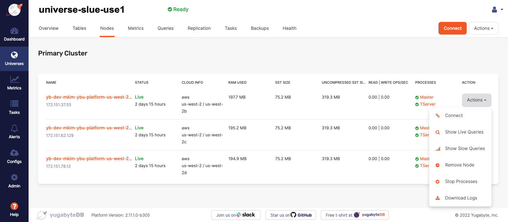

Select "Connect" and copy the command to SSH into this node.

```bash
sudo ssh -i /opt/yugabyte/yugaware/data/keys/be5f73e4-3bfe-4b55-8c1c-0aa144be10d6/yb-dev-aws_be5f73e4-3bfe-4b55-8c1c-0aa144be10d6-key.pem -ostricthostkeychecking=no -p 22 yugabyte@<node-IP>
```

As can be seen the the preceding statement, the `.pem` key for the node instance is located on the EC2 instance that contains Yugabyte Platform. This value was automatically generated when the Universe was created. You will be accessing the node through port 22 with the user name `yugabyte`.

Make a note of this command since you will use it to SSH into the node.

## Drop the Table

In the last step, you created a backup of the database, `postgres`, that contains the table, `postgresqlkeyvalue`. In this step, you will drop the table, then restore the table from the backup in the S3 bucket.

In this step, you will need the `.pem` file to SSH into the EC2 instance.

In order to drop the table, you will SSH into the EC2 instance that contains the Yugabyte Platform console, connect to a node, then connect to the YSQL shell to access the database. 

### Connect to the Node

In order to connect to the node, we will first connect to the EC2 instance containing the Yugabyte Platform console. In the CLI, execute the following command if you `.pem` file is located in the `.ssh` directory:

```bash
ssh -i "~/.ssh/ybu-yugaware.pem" centos@<my-EC2-public-IPv4>
```

Once connected to the EC2 instance, paste the SSH command you noted earlier to connect to the node that contains the `.pem` file for your node. An example of this SSH command is shown in the following command:

```bash
sudo ssh -i /opt/yugabyte/yugaware/data/keys/be5f73e4-3bfe-4b55-8c1c-0aa144be10d6/yb-dev-aws_be5f73e4-3bfe-4b55-8c1c-0aa144be10d6-key.pem -ostricthostkeychecking=no -p 22 yugabyte@<node-IP>
```

The verify the connection with the command prompt change to reflect the user, `yugabyte`, and the IP address of the node. Here is an example of what the connection will look like:

```bash
[yugabyte@ip-172-151-37-55 ~]$
```

### Connect to the Database with the YSQL Shell

In the last step, you connected to the node. In this step you will open the YSQL shell in order to connect to the database and drop the table.

Run the following command to connect to the YSQL shell:

```bash
/home/yugabyte/tserver/bin/ysqlsh -h <my-node-IP> -p 5433 -U yugabyte
```

In the preceding command, you ran the binary file `ysqlsh` with the declarations for the host, port, and user.

<!-- TODO tserver vs master -->

> **Deep Dive:** [For a closer look at the `ysqlsh` and the shell commands, visit the official Yugabyte docs for more detailed instructions.](https://docs.yugabyte.com/latest/admin/ysqlsh/)

You have successfully connected to the YSQL shell if the prompt now looks like this:

```bash
yugabyte=#
```

Now you can directly connect to the table, view logs, and use PostgreSQL DDL or DML statements to make changes to the data layer.

First, run the following command to list the databases:

```bash
\l
```

This will result in the following response in the CLI:

```bash
                                   List of databases
      Name       |  Owner   | Encoding | Collate |    Ctype    |   Access privileges
-----------------+----------+----------+---------+-------------+-----------------------
 postgres        | postgres | UTF8     | C       | en_US.UTF-8 |
 system_platform | postgres | UTF8     | C       | en_US.UTF-8 |
 template0       | postgres | UTF8     | C       | en_US.UTF-8 | =c/postgres          +
                 |          |          |         |             | postgres=CTc/postgres
 template1       | postgres | UTF8     | C       | en_US.UTF-8 | =c/postgres          +
                 |          |          |         |             | postgres=CTc/postgres
 yugabyte        | postgres | UTF8     | C       | en_US.UTF-8 |
(5 rows)

yugabyte=#
```

Connect to the `postgres` database with the following command:

```bash
\c postgres
```

The preceding command will return the following result:

```bash
yugabyte=# \c postgres
You are now connected to database "postgres" as user "yugabyte".
postgres=#
```

> **Pro Tip:** As a general practice, it is good to turn on the `\timing` feature to measure response time of the SQL operations.

To list the tables, run the following command in `ysqlsh` also known as the YSQL shell:

```bash
\dt
```

This will result in the following response in the CLI.

```bash
               List of relations
 Schema |        Name        | Type  |  Owner
--------+--------------------+-------+----------
 public | postgresqlkeyvalue | table | postgres
(1 row)

postgres=#
```

Determine the number of rows in this table with the following command:

```SQL
SELECT count(*) from postgresqlkeyvalue;
```

This will create the following response in the CLI:

```bash
---------
 2000001
(1 row)

Time: 2850.394 ms (00:02.850)
postgres=#
```

Note there are 2,000,001 rows in this table.

Now that you have established the table is present and populated with data, drop this table with the following command:

```SQL
DROP TABLE postgresqlkeyvalue;
```

This command will result in the following response in the CLI:

```bash
DROP TABLE
Time: 199.763 ms
postgres=#
```

### Verify the Table has been Dropped

Now run the `\dt` or `SELECT count(*) from postgresqlkeyvalue;` commands to verify the table is no longer available. The CLI will result in the following response:

```bash
Did not find any relations
```

Leave this YSQL shell open so later, you can verify the table has been restored.

Navigate back to the Yugabyte Platform console in the browser to verify that the `postgresqlkeyvalue` table is no longer available. Select the "Tables" tab in the Universe Details page to see the following image:

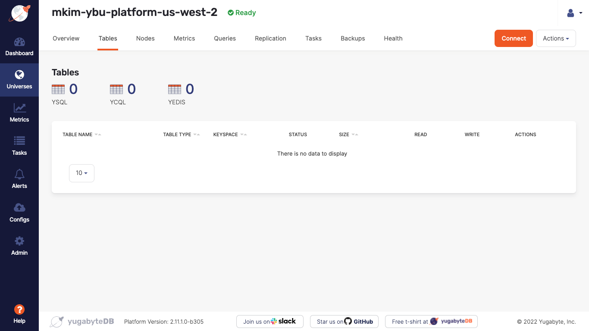

Note in the preceding image that there are no longer any available tables in this Universe.

## Restore the Table

In the last step, you dropped the table, then verified the table is no longer present in the Universe. In this step, you will restore the table and verify the data remains consistent with the data prior to the DROP command.

On the Yugabyte Platform console, in the Universe details page, select the "Backups" tab. Select the "Actions" button for this backup and choose the "Restore Backup" option as shown in the following image:

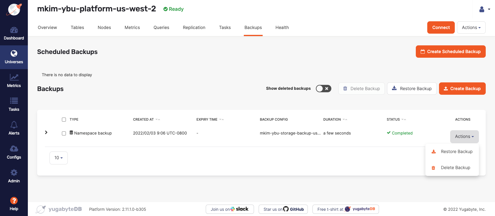

By selecting the "Restore Backup" option, a form will appear as shown in the following image:

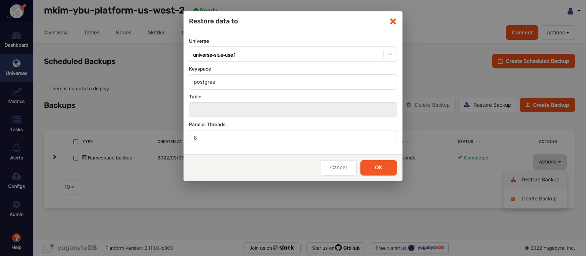

In the preceding form, select the default options for the current Universe and the keyspace or database, `postgres`, keeping the same number of parallel threads. 

> **Pro Tip:** Increasing the parallel thread capacity will result in a faster backup or backup restore. This decision depends on the size of the backup as well as the resource capacity of the EC2 instances.

Once the backup restore has completed, check the "Tables" tab in the Universes details page to see if the table has been restored as shown in the following image:


Note that in the preceding image, the YSQL table has been restored in the Universe.
### Verify the Table has been Restored

In the last step, the table was restored. In this step, you will verify the data was restored with no data loss.

Navigate back to the CLI that is connected to the database via the YSQL shell. Run the following command:

```bash
SELECT count(*) from postgresqlkeyvalue;
```

You will see the following response in the CLI:

```bash
---------
 2000001
(1 row)
```

From the preceding SQL query response, we have verified that the table has been restored and there has been no data loss from the backup and restore process.

## Reflection

In this lab, you created a backup of the YSQL database and restored it. You also connected to a YSQL shell on the node to access the database in order to remove the table.