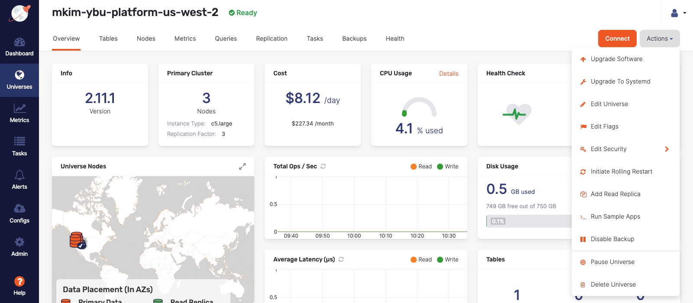

# Scale the Cluster (up/down) on Yugabyte Platform (Anywhere)

## Introduction

In this hands-on lab, you will scale a cluster up and down to demonstrate how a Universe in Yugabyte Platform is able to react to a change in the capacity of the cluster.  In the real world, a capacity change of a cluster due to an increase in traffic or a hardware failure is inevitable and important to demonstrate to clients. Demonstrating fault tolerance of the Yugabyte Platform is a mission critical POC to any client.

This lab will show how easy it is to add and eliminate a node in the cluster to demonstrate the load balancing ability of the Raft Consensus algorithm.

This lab will use a three-node multi-zone single region Universe that has run the `SqlInserts`, `SqlSecondaryIndex`, and `SqlSnapshotTxns` key-value YSQL workloads on AWS.

### Objective

As a sales engineer, I want to demonstrate the auto load balancing ability of the Yugabyte Universe when the cluster is scaled up or scaled down.

## Prerequisites

* A deployed three node Universe on AWS. For information on how to deploy this review a previous lab on multi-zone Universe deployment.

* The Universe will run the `SqlInserts`, `SqlSecondaryIndex`, and `SqlSnapshotTxns` YSQL key-value workloads from the [`yb-sample-apps` repository](https://github.com/yugabyte/yb-sample-apps). For a detailed overview on how to do this, review the lab on YSQL workload execution on a Yugabyte Universe.

## Scale up the Yugabyte Universe

In this step, you will scale up the Yugabyte Universe. You will increase the available capacity by adding a node to the current three node cluster.

Normally this process is done whenever the current cluster topology is inadequate to handle a workload. That could be due to an increase in traffic due to a growth in an app's popularity or there is an expected spike in traffic due to a special event or promotion.

The first step is to sign into Yugabyte Platform and select the Universe that is running the YSQL workloads. Any workload will do for this lab however, but we will use this workload's usage metrics to illustrate the workload changes for each node.

You will see the following image once the Universe has been selected:

On the preceding Universe details page, select the "Actions" dropdown button located under the profile icon in the upper right corner.

Select the "Edit Universe" from the dropdown list to navigate to the following form:

As shown in the preceding form, an increase in the current nodes from three to four was done by increasing the Nodes property to four. By doing this, the corresponding additional node was added to one of the availability zones in the Universe.

Select "Save" at the bottom of the page.

You will then be redirected to the Universe details page where a status bar appears at the top of the Universe details page.

Select the "Nodes" tab on the Universe details page to see that the new node is in the state "Unreachable" while the node is being added to the Universe. Once this process has concluded, you will see that the new node has changed to "Live" status as shown in the following image:

Notice in the preceding image that within a few minutes, the new node has successfully begun to balance the load from the other nodes. The new node is actively participating in the Universe by receiving read and write operations. The SST or Sorted String Tables have also been distributed to the new node. Notice that the `TServer` process but not the `Master` process. This is due to the Raft consensus algorithm which must be an odd number. For more details on this, review the [blog post regarding the Raft Consensus Replication Protocol.](https://blog.yugabyte.com/how-does-the-raft-consensus-based-replication-protocol-work-in-yugabyte-db/)