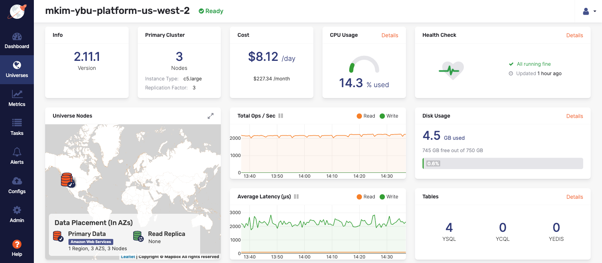
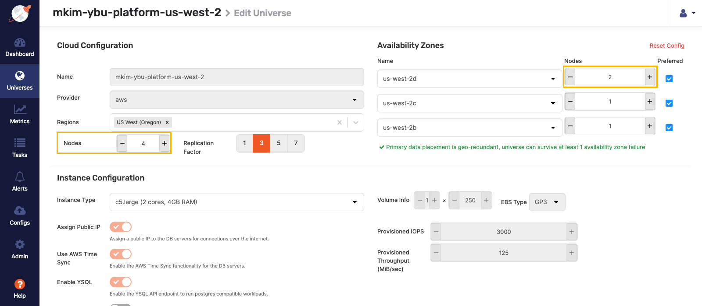
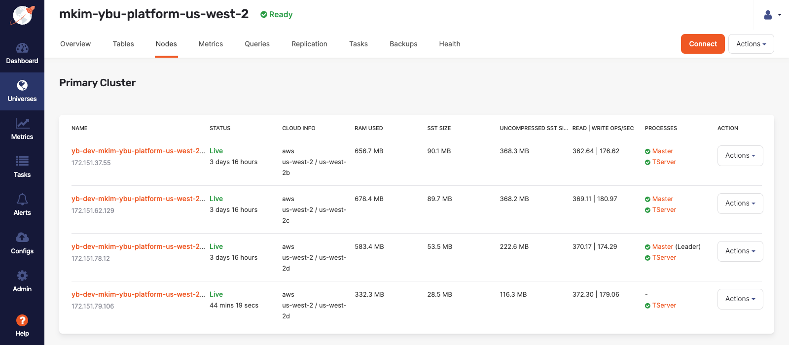
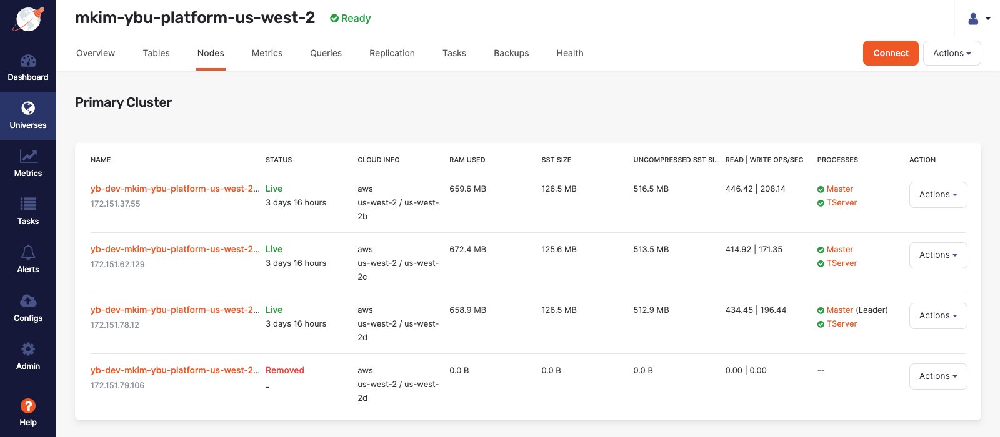

# Scale the Cluster (up/down) on Yugabyte Platform (Anywhere)

## Introduction

In this hands-on lab, you will scale a cluster up and down to demonstrate how a Universe in Yugabyte Platform is able to react to a change in the capacity of the cluster.  In the real world, a cluster's capacity could change due to any number of reasons including increases in traffic due to a special event or a hardware failure. Demonstrating the dynamic auto load balancing ability of a Yugabyte Universe is a critical POC to any client.

This lab will use a three-node multi-zone single region Universe that has run the `SqlInserts`, `SqlSecondaryIndex`, and `SqlSnapshotTxns` key-value YSQL workloads on AWS.

### Objective

As a sales engineer, I want to demonstrate the auto load balancing ability of the Yugabyte Universe when the cluster is scaled up or scaled down.

## Prerequisites

* A deployed three node Universe on AWS will be used to demonstrate scaling up and down. For information on how to deploy this review a previous lab on multi-zone Universe deployment.

* The Universe will run the `SqlInserts`, `SqlSecondaryIndex`, and `SqlSnapshotTxns` YSQL key-value workloads from the [`yb-sample-apps` repository](https://github.com/yugabyte/yb-sample-apps). For a detailed overview on how to do this, review the lab on running YSQL workloads on a Yugabyte Universe.

## Scale Up a Yugabyte Universe

In this step, you will scale up the Yugabyte Universe. You will increase the available capacity by adding a node to the current three node cluster and note the speed at which the Universe is able to auto balance the workload.

Normally scaling up a cluster is necessary whenever the current cluster topology is inadequate to handle a workload. That could be due to an increase in traffic due to a growth in an app's popularity or there is an expected spike in traffic due to a special event or promotion.

The first step is to sign into Yugabyte Platform and select the Universe that is running the YSQL workloads. Any workload will do for this lab however, but we will use this workload's usage metrics to illustrate the workload changes for each node.

You will see the Universe details page once the Universe has been selected:

In the preceding image, you can see that this Universe is a three node cluster with four tables actively processing writes and reads.

Select the "Actions" dropdown button located under the profile icon in the upper right corner of the page.

Select the "Edit Universe" option from the dropdown list to navigate to the following form:

In the preceding form, increase the current nodes from three to four. Notice a node was added to one of the availability zones in the Universe automatically.

Select "Save" at the bottom of the page.

You will then be redirected to the Universe details page where a status bar indicates the progress of the new task.

Select the "Nodes" tab on the Universe details page to see that the new node has been added but its status is currently "Unreachable". Once this process has concluded, you will see that the new node has changed to "Live" status as shown in the following image:

Notice in the preceding image that within a few minutes, the new node has successfully begun to rebalance the workload from the other nodes. The new node is actively participating in the Universe by receiving read and write operations. The SST or Sorted String Tables have also been distributed to the new node. Notice that the `TServer` process, but not the `Master` process is running on the new node. This is due to the Raft consensus algorithm which allocates the number of Master process in direction relation to the Replication Factor, which is three in this Universe. For more details on this, review the [blog post regarding the Raft Consensus Replication Protocol.](https://blog.yugabyte.com/how-does-the-raft-consensus-based-replication-protocol-work-in-yugabyte-db/)

## Scale Down a Yugabyte Universe

In the last step, you scaled up a Yugabyte Universe by adding a node. This demonstrated how a Universe is able to auto balance the read and write operations onto the new node. In this step, you will scale the Universe down by removing a node.

Navigate to the "Nodes" tab on the Yugabyte Platform console to view the current configuration of four nodes as shown in the following image:

Select the "Actions" button for the new node that was added in the last step.

Select "Remove Node" as shown in the following image:

As the Universe removes the node, notice that the read and write operations are automatically rebalanced on the remaining nodes in the cluster. Within a few minutes, the Universe has rebalanced the workload including the SST files onto the remaining working nodes.

> **Pro Tip:** Note that a node can also be removed by editing the Universe and reducing the number of nodes, similar to the process of adding a node that was completed in a previous step in this lab.