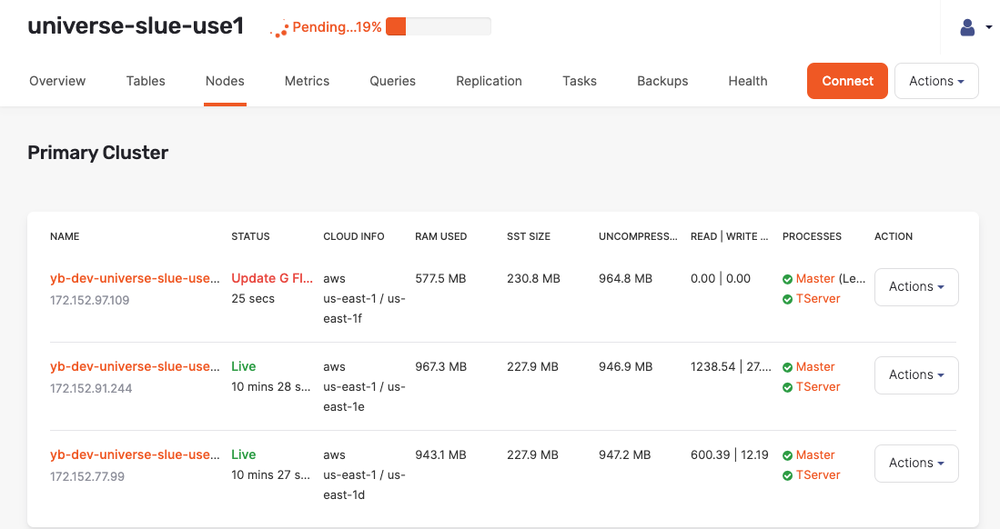
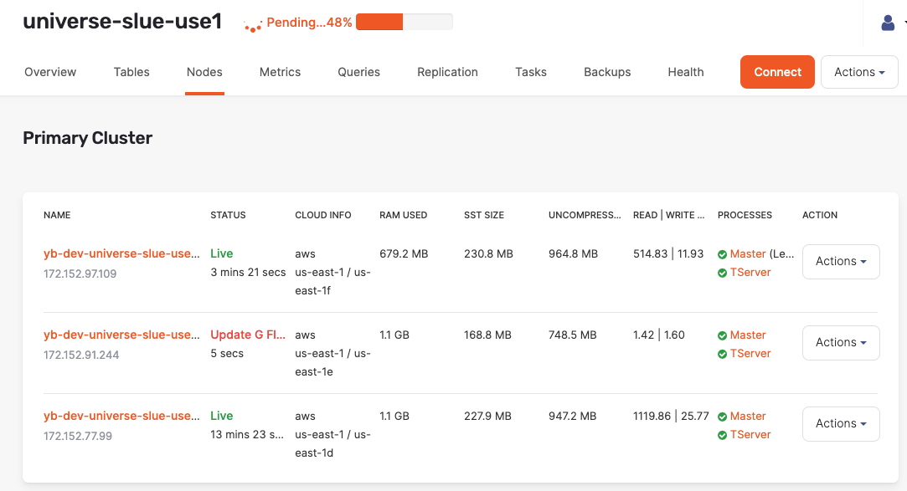
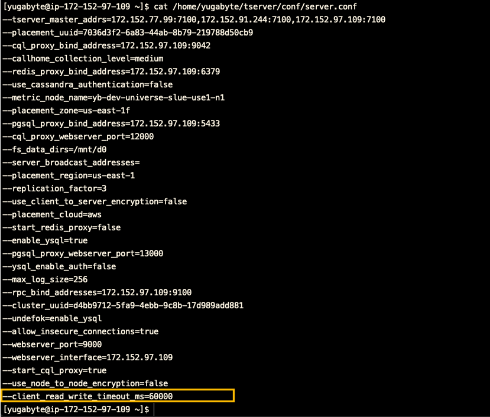

### About this lab

In this hands-on lab, you will perform a rolling configuration change of a cluster on Yugabyte Platform. A configuration change is a way to change how the cluster is operating. This could be due to a customer request for better performance or for increased functionality. To accomplish a configuration change, you will update the G-flag on the Tablet Servers in the Yugabyte Platform Admin console by adding a timeout for reads and writes. 

A rolling change is a common method to implement a configuration change to a cluster of nodes since there is minimal impact on reliably and performance of the database. The reason the impact is limited is because only one node is updated at a time. This means the load is balanced between the remaining active nodes while the one that's being updated has its workload removed.

### Objective

As a sales engineer, I want to perform a rolling configuration change to my Yugabyte Universe without a noticeable change in the cluster's performance.

### Requirements

Here are the requirements for this lab:

* A deployed YugabyteDB cluster (a Universe)

* Yugabyte Platform credentials

* A .pem  file that you can use to connect to the EC2 instance of your YugabyteDB Platform host

* The Yugabyte Universe must be running a workload.

### Resources

To find how to deploy a Yugabyte Universe on Platform review **LAB: Create a Yugabyte Multi-Zone Universe using Yugabyte Platform**. 
To find how to run a sample workload on Yugabyte Platform, review **LAB: Run YB-Sample-Apps from Yugabyte Platform.**

### Edit configuration flags

"Adding and modifying configuration flags for your YB-Master and YB-TServer nodes in a YugabyteDB universe allows you to resolve issues, improve performance, and customize functionality." ~ [Yugabyte Docs](https://docs.yugabyte.com/latest/yugabyte-platform/manage-deployments/edit-config-flags/)

In order to edit a configuration flag for a Yugabyte Universe, navigate to the Yugabyte Platform Admin console located at the public IP of your EC2 instance. If created from `LAB: Create a Yugabyte Multi-Zone Universe using Yugabyte Platform` it will look like the following:

`ec2-<MY-4-CHAR>-use1-1a-az4-platform`

Where `<MY-4-CHAR>` is the four letter name identifier found in your email address.

Once signed in the Yugabyte Platform Admin console, select the YugabyteDB universe that contains the running workload. In this demo, it is running the workloads, `SqlInserts`, `SqlSecondaryIndex`, and `SqlSnapshotTxns` from the repo `yb-sample-apps`. This is why there are four tables with reads and writes occurring the Universe as seen in the following image:

 

> **Troubleshoot:** Having trouble navigating to the Yugabyte Platform Admin console? Make sure the URL address is `http`, not `https`.

Keeping track of the performance is important in order to monitor the universe for performance degradation due to the rolling config change. This could be increases in latency or maxing out the resources on a node.

### Start a rolling config change

Navigate the Universe details page and execute the following steps:

* Select the **More** drop down located under the profile icon on the top right corner. 

> **Pro-Tip:** If you don't see the **Actions** list, try expanding your window.

* Select **Edit Flags** from the drop down list.

* In the pop up, Flags, select **Add Flags**.

* Select **Add as Free text**.

* Select Add to **T-Server**.

* Select **Add to T-Server**.

* Add the following JSON:

    `{ "client_read_write_timeout_ms": 60000 }`

This flag sets the timeout for a read or write as 60000ms.

* In G-Flags Upgrade Options, select **Rolling**.

* Select OK.
  
### Verify a rolling config change

To verify that the rolling config change is taking place, navigate to the Universe details page and select the **Nodes** tab.

As shown in the following image, one of the nodes is slowly shutting down:

Notice that a few minutes later, once the update has completed and the node has come back online, a different node begins its update as shown in the following image:

In this **rolling** config methodology, only one node goes offline to update while the other nodes balance the remaining load. This is how the universe maintains its performance, resiliency, and availability.

One drawback of this method however is that the update does take longer to implement. If this is the more pressing concern, then the **Non-Rolling** option should be considered. This will update all the nodes at once, but will make the YugabyteDB unavailable, therefore causing downtime.

The third option is **Non-Restart** option which uses in-memory cache.

### Verify the configuration was changed

* In the Universe details page, select the **Nodes** tab.

* Select the **Actions** drop down list of the node you wish to connect.

* Select Connect.

* Copy the shell script command.

* SSH into the EC2 instance that is hosting Yugabyte Platform.

* Execute the shell script command.
  
* Display the contents of the `server.conf` file with the following command: `cat /home/yugabyte/tserver/conf/server.conf`
  
If the G-Flag update was successful, you will see the timeout as shown in the following image:

Nice work, the G-Flag was successfully added to this node.
### Reflection

In this lab, you implemented a rolling config change to a cluster on Yugabyte Platform. You understand why configuration changes are common and why a rolling config change is better for highly resilient clusters than a non-rolling strategy. 