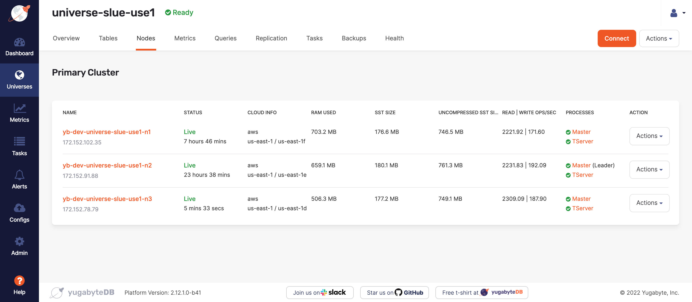
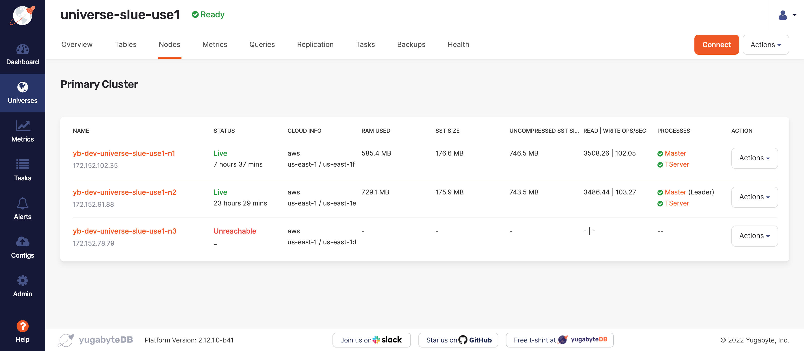
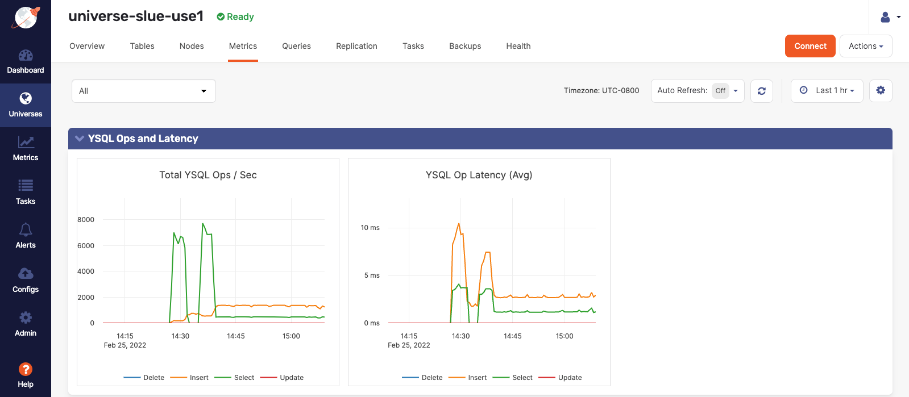

<!-- 
## Styles

	
 -->

⏰ Lab time is 20 min | [slack feedback](https://yugabyte.slack.com/archives/C03176Y6BU0)
***

## About this lab

In this hands-on lab, you will demonstrate how a Yugabyte Universe handles an availability zone failure. Specifically, how the other nodes in the cluster can auto balance the workload so the impact on the application is minimal. 

### About availability zones

Availability zones (AZs) are isolated locations within data center regions from which public cloud services originate and operate. Regions are geographic locations in which public cloud service providers' data centers reside.Availability zones are commonly mistaken to equate to a data center. In fact, many availability zones have three or more data centers. However no two availability zones share a data center.

## Objective

As a sales engineer, I want to demonstrate how a Yugabyte Universe handles an availability zone failure with high availability and resiliency.

## Requirements

Here are the requirements for this lab:

* A deployed YugabyteDB three node cluster (a Universe) in a multi-zone single region topology running a workload
* Yugabyte Platform credentials

### Resources

To find how to deploy a Yugabyte Universe on Platform review **LAB: Create a Yugabyte Multi-Zone Universe using Yugabyte Platform**.

To find how to run a sample workload on Yugabyte Platform, review **LAB: Run YB-Sample-Apps from Yugabyte Platform.**

## Simulate an AZ failure

First, verify that the Yugabyte Universe is running a workload. Go to the EC2 public IP or DNS in the browser. Sign in with your Yugabyte credentials and select the Yugabyte Universe where we will simulate the AZ failure.

### Verify Universe workload

On the Universe Details page, review the **Overview** tab to see that there are currently reads and writes and a table.

Next, select the **Nodes** tab to confirm that all three nodes are healthy, operational, and online. Note that 

Notice that each node is located in a different AZ in us-east-1 as shown in the following image:

## Stop the processes on the leader

On the **Nodes** tab, select **Actions** drop down list for the node that contains the YB-Master Leader, marked as **(Leader)**.

> **Deep Dive:**  For more about [the responsibilities of the YB-Master Leader take a look at the Yugabyte Docs.](https://docs.yugabyte.com/latest/architecture/core-functions/universe-creation/)

Next, select **Stop Processes** on the drop down list and confirm by selecting **OK** from the drop down list.

Check the **Tasks** tab to see the progress of the **Node** shutting down its processes.
You can see that the status of the **Stop Node** process is pending.

Within moments, the node will have a status of **Stopped**. Notice that the Raft Consensus has elected a new Leader, while the workload of the stopped node has shifted to the **Live** nodes as shown in the following image:

Now that the workload has distributed, check the **Metrics** tab on the Universe details page to see that the Ops/sec for the cluster has been consistent, even with the capacity reduction as shown in the following image:

### Restart the node

To restart the node execute the following instructions:

* Navigate to the **Nodes** tab on the Universe details page.

* Select the **Actions** drop down list of the node that has been stopped.

* Select **Start Processes**.

* Select **OK** on the confirmation dialog window.

* Navigate to the **Tasks** tab to see the Start Node process is pending.

Once this process has finished, notice that the auto load balancer distributes the read and writes to the restarted node once the tablets are ready on the Tablet server.

## Reflection

The purpose of this lab was to demonstrate how a Yugabyte Universe would handle an availability zone failure. This was accomplished by stopping the processes on a node located in the failed AZ.

A new leader was elected for the Raft group and the workload was successfully distributed between the remaining "live" nodes.

Even though an AZ failed, the remaining nodes were able to auto balance the workload to remain consistent in Ops/sec and Latency metrics.

That's it.

> **Important:** Remember to use the Slack link at the top of this lesson to leave your comments. Please note the Section title and name of the lesson.

Thank you! 😀

