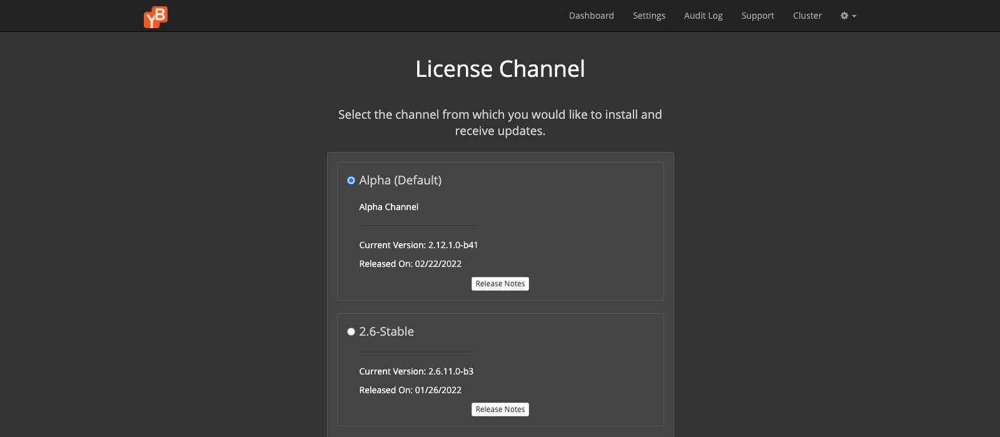
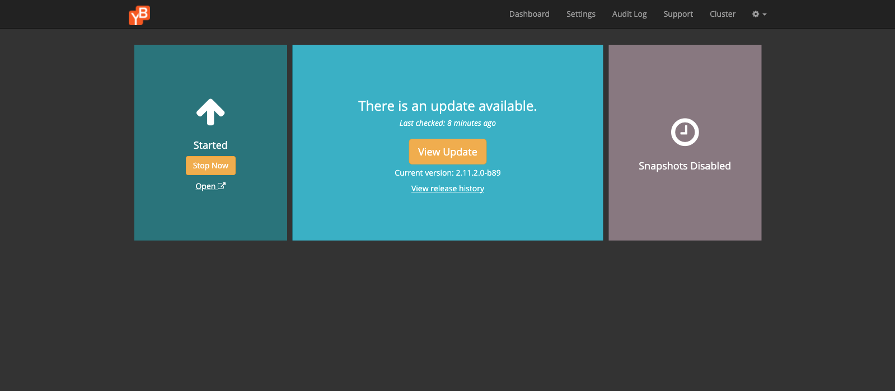
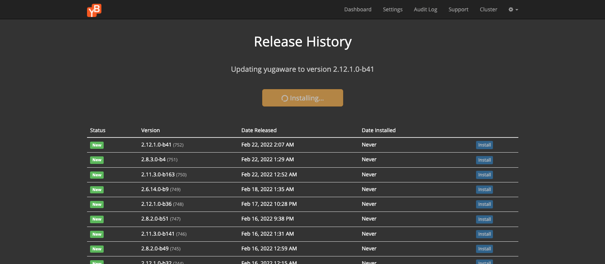
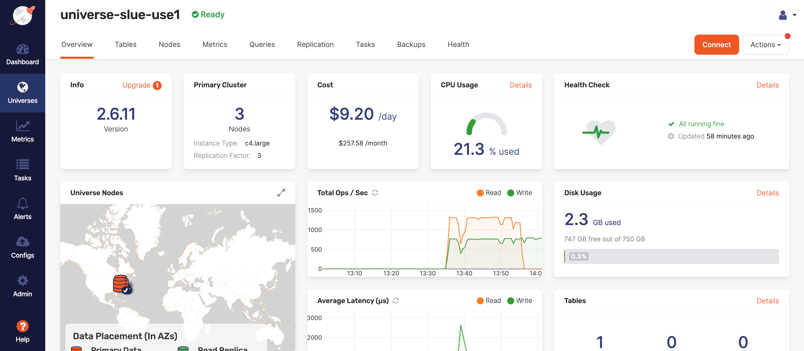
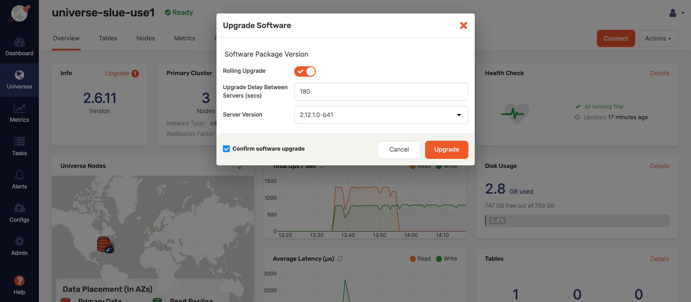

⏰ Lab time is 20 min | [slack feedback](https://yugabyte.slack.com/archives/C03176Y6BU0)

## About this lab

In this hands-on lab, you will perform a rolling software upgrade of a cluster on Yugabyte Platform. New versions of Yugabyte Platform will often contain security enhancements, advanced topology integrations, UI support, and much more. Many of the improvements involve addressing customer requests so clients may wish to upgrade quickly to implement the new features.

You will perform a rolling software upgrade so that the application doesn't experience any downtime. You will upgrade Platform from version 2.6 to 2.12 in this lab.

### Objective

As a sales engineer, I want to perform a software version upgrade to my Yugabyte Universe so that there is no disruption to my application.

### Requirements

Here are the requirements for this lab:

* A deployed multi-node YugabyteDB cluster (a Universe) running on an older version of Yugabyte running a workload.

* Yugabyte Platform credentials

* Replicated dashboard password

* A .pem file that you can use to connect to the EC2 instance of your YugabyteDB Platform host

### Resources

The topology of the Yugabyte Universe in this lab will be a three node cluster set up in multiple zones in the same region. The Yugabyte Universe will be version 2.6 stable. The sample workload running on this cluster will be the `SqlInserts` Java application which will perform SQL reads and writes to the table. The Universe is deployed on AWS in us-east-1.

To find out how to deploy a Yugabyte Universe on Platform review **LAB: Create a Yugabyte Multi-Zone Universe using Yugabyte Platform**. Specify version 2.6-stable.

To find out how to run a sample workload on Yugabyte Platform, review **LAB: Run YB-Sample-Apps from Yugabyte Platform.**

## Update Platform version

To update the Platform software version in your Universe, follow the subsequent steps:

* First, verify the YugabyteDB cluster is online and processing a workload.

* Navigate to the Yugabyte Platform Admin console in the browser. This will be your platform URL. 

* Navigate to the Replicated dashboard. This is EC2's IP that hosts Platform at port 8800. Enter the password in the prompt.

* Select the Settings icon located in the upper right corner of the dashboard.

* Select **View License**.

* For the option: Release Channel: Select **change**. This will navigate you to the following page:

* Select Alpha(Default). This will update the Platform version to the newest version. In this lab, it will be version 2.12.
  
* Select Save.

* Select **Sync License**. A success dialog box will confirm the change.

* Select **Dashboard** in the nav bar to navigate to the Replicated dashboard.

* Notice there is a message on the dashboard that indicates an update is available as shown in the following image:

* Select the **View release history** link located in the middle panel.

* Select **Install Update** to begin the software update process as shown in the following image:

> **Question:** Why would anyone wish to update to the alpha version which is more current than the latest version.
>
> **Answer:** To test new features and compatibility.

## Upgrade the Universe

Now that Platform has upgraded to a newer version, it's time to implement the software update on the nodes.

* Navigate to the Platform UI to implement the software upgrade.

* Select the Universe that will undergo the software change.

* In the **Actions** button, located on the upper right corner on the Universe Details page you will see an orange dot indicating an update is available as shown in the following image:

* Select **Upgrade Software**, which will open the following form:

Confirm the following values are assigned:

| Property Name                        | Property Value |
| ------------------------------------ | -------------- |
| Rolling Upgrade                      | Enabled        |
| Upgrade Delay Between Servers (secs) | 180            |
| Server Version                       | 2.12.1.0-b.41  |
| Confirm software upgrade             | Enabled        |

* Select the **Upgrade** button at the bottom of the form to initiate the Universe upgrade process.

Notice that the rolling upgrade method cycles between each node, allowing for high availability during the updating process.

After a few minutes, the updating process has completed as can be verified by the version number on the Universe Details page.

## Reflection

In this lab, you implemented a software update to a cluster on Yugabyte Platform. Clients appreciate upgrades to the software, since the newer versions often address security, feature enhancements, and UI improvements. The ability to demonstrate how to perform a software upgrade without interruption to the application by using a rolling change methodology is critical to show especially for mission critical functions.

## Terminate the universe

If you do not plan on continuing the curriculum or decide it will be sometime before you touch this universe for a while, go ahead and terminate this universe so as not to incur unnecessary costs.

* Go to the Universe details page.
* Select Actions.
* Select Delete Universe from the drop down list.
* Enter the name of the universe.
* Check the Ignore Errors and Force Delete box.
* Check the Delete Backups box.
* Select Yes.

Deleting a universe will also remove the underlying infrastructure in AWS.
Pausing a universe however will not.