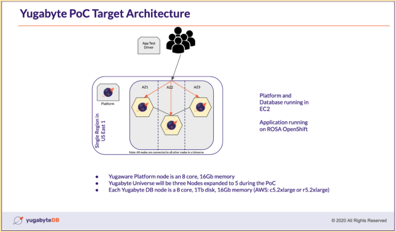
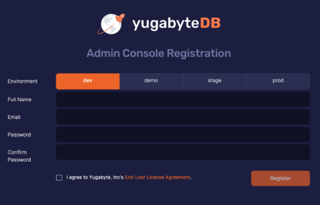
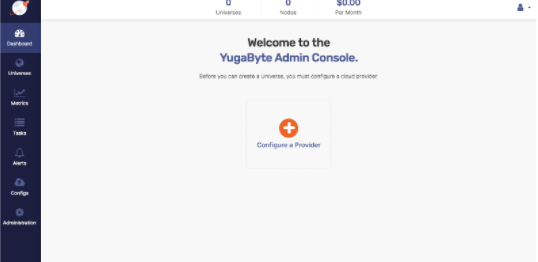
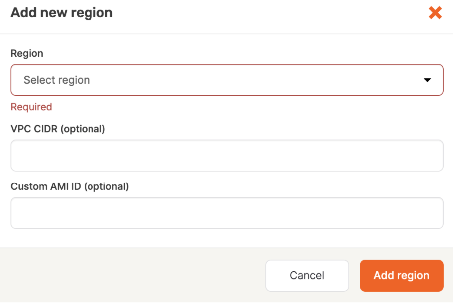

# Create a Yugabyte Multi-Zone Universe using Platform (Anywhere)

## Introduction

In this hands-on deployment lab, you will create a Yugabyte Universe that consists of a three node cluster in a multi-zone topology. Each node will reside in the same region, but in a different availability zone. The purpose is to demonstrate Yugabyte Platform's ability to provide high availability and workload distribution. The added resiliency in a multi-zone architecture protects against potential failures in case resources in a single availability zone become unavailable. This topology can withstand a single zone failure, but not two or more.

The architecture of this three-node database cluster includes a stand-alone server that hosts the Platform management component and an additional driver server that will host test applications and tools. 

> **TODO:** add screenshot of architecture diagram
<!--  -->
## Prerequisites

Before creating a universe, the cloud provider environment must first be configured according to the specifications found on the [Yugabyte docs page on cloud configuration.](https://docs.yugabyte.com/latest/yugabyte-platform/configure-yugabyte-platform/set-up-cloud-provider/aws/) This is to secure the database as well as create access points in the VPC to allow YugabyteDB to connect and communicate with the different nodes in the cluster.

> **Important:** Make a careful note which region contains the VPC and EC2 instance.

In this lab, we will focus on deployment with AWS.

## Checklist of necessary steps to install Yugabyte Platform

1. Complete AWS prerequisites (IAM role, access keys, Routing Table entry, Security Group, VPC + subnets, Internet Gateway)

2. Obtain AWS IAM role access ID and secret keys

3. Obtain Yugaware license file (.rli) from Yugabyte Representative

4. Create AWS EC2 instance to run Yugaware platform

5. Deploy the Yugaware platform onto the AWS provider

6. Create a YugabyteDB Universe via Yugaware platform configure for a three node cluster in three availability zones

### Important Terminology

* Yugaware platform vs Yugabyte Platform

* Universe vs Cluster


<!-- ## User Stories

* As a user, I want to deploy a 3 node cluster, one node in each availability zone.

* As a user, I want to each node to reside in a different availability zone. -->

### Launch the EC2

Once the VPC, security group, IAM role, subnets, routing table entry, and Internet Gateway have been set up, we can proceed with launching the EC2 instance using an AMI. The EC2 will perform as the server that will host the Yugaware platform.

To begin, log into the Amazon account and navigate to the EC2 console to launch an instance with the following specifications:

* Instance type: c5.2xlarge

* IAM instance template: CentOS 7.9.2009 x86_64 - ami-00e87074e52e6c9f9 or a suitable privately created CentOS 7.9 image

* Network VPC and subnets: <as created in the prerequisite>

* Disk storage: gp3 16GB for sample workloads, not ephemeral

* VPC network: <as created in the prerequisite>

* Security Group: <as created in the prerequisite>

* SSH access key: <generate and save a new key if required>

In this lab, we will be using a `c5.2xlarge`. The specifications of this instance type allow for the necessary processing power, 8 cores and 16GiB RAM, that are necessary to demonstrate Yugabyte Platform effectively as well as run sample workloads.

On a production workload, it is recommended to use a minimum of 16 cores and 32 GiB memory, if not more depending on the client. (i.e. AWS EC2 instance type c5.4xlarge)

The EBS volume can also be increased if a larger workload is desired for a demonstration.

> **Important:** When creating the EC2 instance, ensure the Public IP address setting is ENABLED if it is desired to connect to the server from outside the AWS VPC (eg. from users’ workstations or applications running in Kubernetes environments).

SSH into the EC2 once it is running to configure the environment for the Yugaware platform.

## Install the Yugaware Platform

In the last step, you launched an EC2 instance using the specification and VPC environment required by Yugabyte Platform.

In this step, you will connect to the server and set up the initial configuration so that you can install Replicated, a third party tool used to verify the Yugabyte license and install the Yugaware platform.

### Setup the Initial Configuration

Once connected to the server by SSH, perform the initial configuration steps to install the Yugaware platform.

1. Set the hostname: `sudo hostnamectl set-hostname platform`

2. Update the Operating System on the server: `sudo yum -y update`

3. Install `wget`: `sudo yum install -y wget`

4. Install `curl`: `sudo yum install -y curl`

### Install Replicated on the Server

Once the server has been configured, you will use Replicated to pull the Yugaware platform image once the license has been authenticated.

The following Replication script will first install the correct version of Docker onto the server, then download and run the required Docker containers from the Replicated repository. 

In order to complete the next step, the Platform 2.11 (latest) license file, which ends in a `.rli` extension, must be obtained from a Yugabyte representative.

Logged in as the user, `centos` (default), runs the following command on the server to install Replicated and Docker:

```bash
curl -sSL https://get.replicated.com/docker | sudo bash
```

Once the script has run, a series of prompts will appear in the terminal.

```bash
Do you want to the IP address of the machine?
```

Reply with the default answer: Yes

```bash
Do you need a proxy to connect to the internet?
```

Reply with the default answer: No

Once these questions have been answered, Replicated and Docker will be installed on your server.

To verify the installation on your server has completed, you will receive the following output in your terminal:

```bash
Operator installation successful
To continue the installation, visit the following URL in your browser:
  http://xx.xxx.xxx.xx:8800
To create an alias for the replicated cli command run the following in your current shell or log out and log back in:
  source /etc/replicated.alias
```

The url in your message will reflect the public IP of your server. At port 8800, the Replicated console that will allow us to pull the Yugaware image from the Replicated registry.

### Complete the Yugaware Installation with the .rli license

In the last step, we configured the server and installed Replicated. In the next step, we will pull the Yugaware platform image from the Replicated registry once the license has been authenticated.

Navigate to the IP address of your server at port 8800 in your browser to connect to the Replicated console as noted in the proceeding terminal message.

There you will see the following screen:

> **TODO: Image** Replicated UI form

1. Select "Continue to Setup" to begin the installation process.

2. Next, you will see a warning page regarding security risks due to a self-signed certificate.

3. Select "Advanced" and then select "Accept the risk and continue". 
   
> **Important:** There will not be any security risks in this process since we are used a self-signed SSL/TLS Certificate to secure the communication between your local machine and the Admin Console.

4. On the next screen titled HTTPS for admin console, we will select "Use the Self-Signed Cert".

5. On the resulting pop-up, select "Continue without a hostname". 
Once the internal setup has completed, the next screen will prompt you to Upload your license.

6. Select "Choose license" to upload the `.rli` file from your machine.

7. Once uploaded, select "Online" on the next screen and select "Continue".

8. The next screen will offer a list of Yugaware versions covered by the license.
   Select the "Latest" version, 2.11.

9. The next screen will progress through a long list of pre-flight checks which will turn to green once verified.
   Select "Continue" to proceed with the installation.

10. The next screen titled Settings will consist of a web form. Make sure that the field "Hostname" contains the server's IPV4 public IP.

11. Leave the other fields defaults as-is and select "Save" at the bottom of the screen.

12. A dialog box will appear. Select the button "Settings Saved - Restart Now". This will begin the Yugaware installation process.

13. The next screen will be the Replicated dashboard that indicates the status of the Yugaware installation. 
    Once the status on the left panel has changed from "Starting" to "Started", select "Open".

> **Important:** You may receive a Bad Gateway 500 error the first time you select the link , then try again to display the Yugaware console which has been installed on port 80 on the server. Supported web browsers included Chrome, Firefox, and Safari.

## Add the Cloud Provider

In the last step, you installed Replicated, then used it to install Yugaware onto port 80 on the server. In this step, you will register as a user with Yugabyte Platform, accept the license agreement, add the cloud provider, AWS, and specify the region where the Yugabyte cluster will be deployed.

Once you have navigated to the Yugaware console you will see the following which displays the registration form for the Yugabyte Platform:

> **TODO:** Add Screenshot Yugabyte Platform Admin Console
<!--  -->

Keep these credentials handy to login since they will be necessary to authenticate into Yugabyte Platform.

1. Select the `dev` Environment for this lab.

2. Enter your credentials, check the End User License Agreement, then select "Register"

3. On the next screen, enter the email and password then select "Login".

4. Once your credentials have been authenticated, you will be navigated to the following screen:

> **TODO:** Add Screenshot Yugabyte Platform Admin Console
<!--  -->

### Configure the Cloud Provider

> **Important:** To complete this step, you will need your access and secret keys for the EC2 instance.

One or more cloud providers can be configured. A provider is a set of configuration properties for accessing physical resources on which to build YugabyteDB Universes. 

Select the "Configure a Provider" button to add a provider on the Cloud Provider form. 
This page can also be accessed by selecting the "Configs" option on the left hand menu panel.

In this lab, we will continue using AWS as the cloud provider.

> **TODO:** Add Screenshot Cloud Provider Configuration Form 
<!--  -->

> **Important:** Only use lower case characters and hyphens "-".

1. Provider Name: <my AWS environment>

2. Credential Type: <leave as default: "Input Access and Secret Keys>

3. Access Key ID: <Enter the Access Key>

4. Secret Access Key: <Enter the Secret Key>

5. Keypairs Management: <leave at the default “allow YW to manage key pairs”>

6. SSH Port: 22

7. SSH User: centos

8. Leave all subsequent fields default. (i.e. create VPC as default)

9. Select “Add region” button. The following dialog box will be displayed:

> **TODO:** Add screenshot of pop-up
<!--  -->

10. Use the dropdown to select the AWS region that contains the server created in the previous steps.
## Create a Universe


## Terminate a Universe